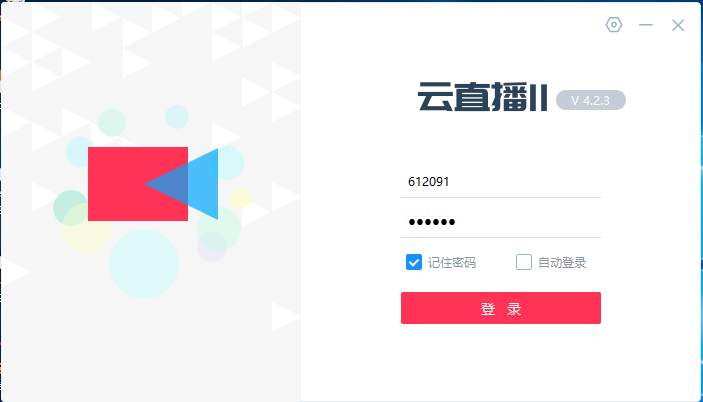

## 硅谷课堂第十三天-公众号点播课程和直播管理

[TOC]

### 一、实现公众号点播课程相关功能

#### 1、课程列表和详情

##### 1.1、需求说明

**（1）点击课程中的分类，根据分类查询课程列表**


**（2）点击 去看看，进入课程详情页面**


##### 1.2、编写课程列表和详情接口

**（1）创建CourseApiController**

```java
@Api(tags = "课程")
@RestController
@RequestMapping("/api/vod/course")
public class CourseApiController {

    @Autowired
    private CourseService courseService;

    @Autowired
    private ChapterService chapterService;

    //根据课程分类查询课程列表（分页）
    @ApiOperation("根据课程分类查询课程列表")
    @GetMapping("{subjectParentId}/{page}/{limit}")
    public Result findPageCourse(@ApiParam(value = "课程一级分类ID", required = true) @PathVariable Long subjectParentId,
                                 @ApiParam(name = "page", value = "当前页码", required = true) @PathVariable Long page, 
                                 @ApiParam(name = "limit", value = "每页记录数", required = true) @PathVariable Long limit) {
        //封装条件
        CourseQueryVo courseQueryVo = new CourseQueryVo();
        courseQueryVo.setSubjectParentId(subjectParentId);
        //创建page对象
        Page<Course> pageParam = new Page<>(page,limit);
        Map<String,Object> map = courseService.findPage(pageParam,courseQueryVo);
        return Result.ok(map);
    }

    //根据ID查询课程
    @ApiOperation("根据ID查询课程")
    @GetMapping("getInfo/{courseId}")
    public Result getInfo(
            @ApiParam(value = "课程ID", required = true)
            @PathVariable Long courseId){
        Map<String, Object> map = courseService.getInfoById(courseId);
        return Result.ok(map);
    }
}
```

**（2）编写CourseService**

```java
//课程列表
Map<String,Object> findPage(Page<Course> pageParam, CourseQueryVo courseQueryVo);

//根据id查询课程
Map<String, Object> getInfoById(Long courseId);
```

**（3）编写CourseServiceImpl**

```java
//课程列表
@Override
public Map<String,Object> findPage(Page<Course> pageParam, CourseQueryVo courseQueryVo) {
    //获取条件值
    String title = courseQueryVo.getTitle();//名称
    Long subjectId = courseQueryVo.getSubjectId();//二级分类
    Long subjectParentId = courseQueryVo.getSubjectParentId();//一级分类
    Long teacherId = courseQueryVo.getTeacherId();//讲师
    //封装条件
    QueryWrapper<Course> wrapper = new QueryWrapper<>();
    if(!StringUtils.isEmpty(title)) {
        wrapper.like("title",title);
    }
    if(!StringUtils.isEmpty(subjectId)) {
        wrapper.eq("subject_id",subjectId);
    }
    if(!StringUtils.isEmpty(subjectParentId)) {
        wrapper.eq("subject_parent_id",subjectParentId);
    }
    if(!StringUtils.isEmpty(teacherId)) {
        wrapper.eq("teacher_id",teacherId);
    }
    //调用方法查询
    Page<Course> pages = baseMapper.selectPage(pageParam, wrapper);

    long totalCount = pages.getTotal();//总记录数
    long totalPage = pages.getPages();//总页数
    long currentPage = pages.getCurrent();//当前页
    long size = pages.getSize();//每页记录数
    //每页数据集合
    List<Course> records = pages.getRecords();
    records.stream().forEach(item -> {
        this.getTeacherOrSubjectName(item);
    });

    Map<String,Object> map = new HashMap<>();
    map.put("totalCount",totalCount);
    map.put("totalPage",totalPage);
    map.put("records",records);

    return map;
}

//获取讲师和分类名称
private Course getTeacherOrSubjectName(Course course) {
    Teacher teacher = teacherService.getById(course.getTeacherId());
    if(teacher != null) {
        course.getParam().put("teacherName",teacher.getName());
    }

    Subject subjectOne = subjectService.getById(course.getSubjectParentId());
    if(subjectOne != null) {
        course.getParam().put("subjectParentTitle",subjectOne.getTitle());
    }
    Subject subjectTwo = subjectService.getById(course.getSubjectId());
    if(subjectTwo != null) {
        course.getParam().put("subjectTitle",subjectTwo.getTitle());
    }
    return course;
}

//根据id查询课程
@Override
public Map<String, Object> getInfoById(Long id) {
    //更新流量量
    Course course = baseMapper.selectById(id);
    course.setViewCount(course.getViewCount() + 1);
    baseMapper.updateById(course);

    Map<String, Object> map = new HashMap<>();
    CourseVo courseVo = baseMapper.selectCourseVoById(id);
    List<ChapterVo> chapterVoList = chapterService.getNestedTreeList(id);
    CourseDescription courseDescription = descriptionService.getById(id);
    Teacher teacher = teacherService.getById(course.getTeacherId());
    
    //TODO后续完善
    Boolean isBuy = false;
    
    map.put("courseVo", courseVo);
    map.put("chapterVoList", chapterVoList);
    map.put("description", null != courseDescription ?
            courseDescription.getDescription() : "");
    map.put("teacher", teacher);
    map.put("isBuy", isBuy);//是否购买
    return map;
}
```

**（4）编写CourseMapper**

```java
public interface CourseMapper extends BaseMapper<Course> {

    CoursePublishVo selectCoursePublishVoById(Long id);

    CourseVo selectCourseVoById(Long id);
}
```

**（5）编写CourseMapper.xml**

```xml
<?xml version="1.0" encoding="UTF-8"?>
<!DOCTYPE mapper PUBLIC "-//mybatis.org//DTD Mapper 3.0//EN" "http://mybatis.org/dtd/mybatis-3-mapper.dtd">
<mapper namespace="com.atguigu.ggkt.vod.mapper.CourseMapper">

    <select id="selectCoursePublishVoById" resultType="com.atguigu.ggkt.vo.vod.CoursePublishVo">
        SELECT
        c.id,
        c.title,
        c.cover,
        c.lesson_num AS lessonNum,
        c.price,
        t.name AS teacherName,
        s1.title AS subjectParentTitle,
        s2.title AS subjectTitle
        FROM
        <include refid="tables" />
        WHERE c.id = #{id}
    </select>

    <select id="selectCourseVoById" resultType="com.atguigu.ggkt.vo.vod.CourseVo">
        SELECT
        <include refid="columns" />
        FROM
        <include refid="tables" />
        WHERE c.id = #{id}
    </select>
    
    <sql id="columns">
        c.id,
        c.title,
        c.lesson_num AS lessonNum,
        c.price,
        c.cover,
        c.buy_count AS buyCount,
        c.view_count AS viewCount,
        c.status,
        c.publish_time AS publishTime,
        c.teacher_id as teacherId,
        t.name AS teacherName,
        s1.title AS subjectParentTitle,
        s2.title AS subjectTitle
    </sql>
    
    <sql id="tables">
        course c
        LEFT JOIN teacher t ON c.teacher_id = t.id
        LEFT JOIN subject s1 ON c.subject_parent_id = s1.id
        LEFT JOIN subject s2 ON c.subject_id = s2.id
    </sql>
</mapper>
```


##### 1.3、整合课程列表和详情前端

**（1）查看路由文件**


**（2）创建js文件定义接口**


```js
import request from '@/utils/request'
const api_name = '/api/vod/course'
export default {
  // 课程分页列表
  findPage(subjectParentId, pageNo, pageSize) {
    return request({
      url: `${api_name}/${subjectParentId}/${pageNo}/${pageSize}`,
      method: 'get'
    })
  },
  // 课程详情
  getInfo(courseId) {
    return request({
      url: `${api_name}/getInfo/${courseId}`,
      method: 'get'
    })
  }
}
```

**（3）编写页面**


**course.vue**

```vue
<template>
    <div>
        <van-image width="100%" height="200" src="https://cdn.uviewui.com/uview/swiper/1.jpg"/>
        <van-pull-refresh v-model="refreshing" @refresh="onRefresh">
            <!-- offset：滚动条与底部距离小于 offset 时触发load事件 默认300，因此要改小，否则首次进入一直触发  -->
            <van-list v-model="loading" :finished="finished" finished-text="没有更多了" offset="10" @load="onLoad">
                <van-card
                        v-for="(item,index) in list" :key="index"
                        :price="item.price"
                        :title="item.title"
                        :thumb="item.cover"
                >
                    <template #tags>
                        <van-tag round plain color="#ffe1e1" text-color="#ad0000">课时数：{{ item.lessonNum }}</van-tag>
                        <br/>
                        <van-tag round plain color="#ffe1e1" text-color="#ad0000">购买数：{{ item.buyCount }}</van-tag>
                        <br/>
                        <van-tag round plain color="#ffe1e1" text-color="#ad0000">访问量：{{ item.viewCount }}</van-tag>
                    </template>
                    <template #footer>
                        <van-button size="mini" @click="info(item.id)">去看看</van-button>
                    </template>
                </van-card>
            </van-list>
        </van-pull-refresh>
    </div>
</template>
<script>
import courseApi from '@/api/course'
export default {
    name: "Course",
    data() {
        return {
            subjectParentId: 1,
            loading: false,
            finished: false,
            refreshing: false,
            pageNo: 1,
            pageSize: 5,
            pages: 1,
            list: []
        };
    },
    created() {
        this.subjectParentId = this.$route.params.subjectId;
    },
    methods: {
        onLoad() {
            this.fetchData();
        },
        onRefresh() {
            // 清空列表数据
            this.finished = false;
            this.pageNo = 1;
            // 重新加载数据
            // 将 loading 设置为 true，表示处于加载状态
            this.loading = true;
            this.fetchData();
        },
        fetchData() {
            courseApi.findPage(this.subjectParentId, this.pageNo, this.pageSize).then(response => {
                console.log(response.data);
                if (this.refreshing) {
                    this.list = [];
                    this.refreshing = false;
                }
                for (let i=0;i<response.data.records.length;i++) {
                    this.list.push(response.data.records[i]);
                }
                this.pages = response.data.pages;
                this.loading = false;
                if(this.pageNo >= this.pages) {
                    this.finished = true;
                }
                this.pageNo++;
            });
        },
        info(id) {
            this.$router.push({path: '/courseInfo/' + id})
        }
    }
}
</script>
<style lang="scss" scoped>
    .list {
        li {
            margin: 10px;
            padding-bottom: 5px;
            border-bottom: 1px solid #e5e5e5;
            h1 {
                font-size: 20px;
            }
            .list-box {
                display: flex;
                font-size: 14px;
                ul {
                    flex: 1;
                    margin: 0;
                    li {
                        margin: 0;
                        border-bottom: none;
                    }
                }
                p {
                    margin: 0;
                    width: 50px;
                    align-items: center;
                    align-self: flex-end;
                }
            }
        }
    }
</style>
```


**courseInfo.vue**

```vue
<template>
  <div>
    <van-image width="100%" height="200" :src="courseVo.cover"/>
    <van-row>
      <van-col span="8">
        <div class="course_count">
          <h1>购买数</h1>
          <p>{{ courseVo.buyCount }}</p>
        </div>
      </van-col>
      <van-col span="8">
        <div class="course_count">
          <h1>课时数</h1>
          <p>{{ courseVo.lessonNum }}</p>
        </div>
      </van-col>
      <van-col span="8">
        <div class="course_count">
          <h1>浏览数</h1>
          <p>{{ courseVo.viewCount }}</p>
        </div>
      </van-col>
    </van-row>
    <h1 class="van-ellipsis course_title">{{ courseVo.title }}</h1>
    <div class="course_teacher_price_box">
      <div class="course_teacher_price">
        <div class="course_price">价格：</div>
        <div class="course_price_number">￥{{ courseVo.price }}</div>
      </div>
      <div>
        <van-button @click="see()" v-if="isBuy || courseVo.price == '0.00'" plain type="warning" size="mini">立即观看</van-button>
        <van-button @click="buy" v-else plain type="warning" size="mini">立即购买</van-button>
      </div>
    </div>
    <div class="course_teacher_price_box">
      <div class="course_teacher_box">
        <div class="course_teacher">主讲： {{ teacher.name }}</div>
        <van-image :src="teacher.avatar" round width="50px" height="50px" />
      </div>
    </div>
    <div class="course_contents">
      <div class="course_title_font">课程详情</div>
      <van-divider :style="{ margin: '5px 0 ' }" />
      <div class="course_content" v-html="description">
      </div>
      <div class="course_title_font">课程大纲</div>
      <div class="gap"></div>
      <van-collapse v-model="activeNames">
        <van-collapse-item :title="item.title" :name="item.id" v-for="item in chapterVoList" :key="item.id">
          <ul class="course_chapter_list" v-for="child in item.children" :key="child.id">
            <h2>{{child.title}}</h2>
            <p v-if="child.isFree == 1">
              <van-button @click="play(child)" type="warning" size="mini" plain>免费观看</van-button>
            </p>
            <p v-else>
              <van-button @click="play(child)" type="warning" size="mini" plain>观看</van-button>
            </p>
          </ul>
        </van-collapse-item>
      </van-collapse>
    </div>
    <van-loading vertical="true" v-show="loading">加载中...</van-loading>
  </div>
</template>

<script>
import courseApi from '@/api/course'
export default {
  data() {
    return {
      loading: false,
      courseId: null,
      courseVo: {},
      description: '',
      teacher: {},
      chapterVoList: [],
      isBuy: false,
      activeNames: ["1"]
    };
  },
  created() {
    this.courseId = this.$route.params.courseId;
    this.fetchData();
  },
  methods: {
    fetchData() {
      this.loading = true;
      courseApi.getInfo(this.courseId).then(response => {
        console.log(response.data);

        this.courseVo = response.data.courseVo;
        this.description = response.data.description;
        this.isBuy = response.data.isBuy;
        this.chapterVoList = response.data.chapterVoList;
        this.teacher = response.data.teacher;

        this.loading = false;
      });
    },
    buy() {
      this.$router.push({ path: '/trade/'+this.courseId })
    },
    play(video) {
      
    },
    see() {
      this.$router.push({ path: '/play/'+this.courseId+'/0' })
    }
  }
};
</script>
<style lang="scss" scoped>
.gap {
  height: 10px;
}
::v-deep.van-image {
  display: block;
}
.course_count {
  background-color: #82848a;
  color: white;
  padding: 5px;
  text-align: center;
  border-right: 1px solid #939393;
  h1 {
    font-size: 14px;
    margin: 0;
  }
  p {
    margin: 0;
    font-size: 16px;
  }
}
.course_title {
  font-size: 20px;
  margin: 10px;
}
.course_teacher_price_box {
  margin: 10px;
  display: flex;
  justify-content: space-between;
  align-items: center;
  .course_teacher_price {
    display: flex;
    font-size: 14px;
    align-items: center;
    .course_price_number {
      color: red;
      font-size: 18px;
      font-weight: bold;
    }
    .course_teacher {
      margin-left: 20px;
    }
  }
  .course_teacher_box {
    display: flex;
    justify-content: center;
    align-items: center;

    .course_teacher {
      margin-right: 20px;
    }
  }
}
.course_contents {
  margin: 10px;
  .course_title_font {
    color: #68cb9b;
    font-weight: bold;
  }
  .course_content {
    margin-bottom: 20px;
  }
}
.course_chapter_list {
  display: flex;
  justify-content: space-between;
  align-items: center;
  h2 {
    font-size: 14px;
  }
  p {
    margin: 0;
  }
}
</style>
```


#### 2、点播视频播放


##### 1.1、获取视频播放参数

**（1）创建VodApiController**

```java
@Api(tags = "腾讯视频点播")
@RestController
@RequestMapping("/api/vod")
public class VodApiController {

    @Autowired
    private VodService vodService;

    @GetMapping("getPlayAuth/{courseId}/{videoId}")
    public Result getPlayAuth(
            @ApiParam(value = "课程id", required = true)
            @PathVariable Long courseId,
            @ApiParam(value = "视频id", required = true)
            @PathVariable Long videoId) {
        return  Result.ok(vodService.getPlayAuth(courseId, videoId));
    }
}
```

**（3）application.properties添加**

```properties
tencent.video.appid=1312624373
```

**（3）VodService创建方法**

```java
//获取视频播放凭证
Map<String,Object> getPlayAuth(Long courseId, Long videoId);
```

**（4）VodServiceImpl实现方法**

```java
@Value("${tencent.video.appid}")
private String appId;

//点播视频播放接口
@Override
public Map<String, Object> getPlayAuth(Long courseId, Long videoId) {
    //根据小节id获取小节对象，获取腾讯云视频id
    Video video = videoService.getById(videoId);
    if(video == null) {
        throw new GgktException(20001,"小节信息不存在");
    }

    Map<String, Object> map = new HashMap<>();
    map.put("videoSourceId",video.getVideoSourceId());
    map.put("appId",appId);
    return map;
}
```

##### 1.2、整合点播视频播放前端


**（1）创建js定义接口**


```js
import request from '@/utils/request'
const api_name = '/api/vod'
export default {
  // 获取播放凭证
  getPlayAuth(courseId, videoId) {
    return request({
      url: `${api_name}/getPlayAuth/${courseId}/${videoId}`,
      method: 'get'
    })
  }
}
```

**（2）courseInfo.vue修改play方法**

```js
    play(video) {
      let videoId = video.id;
      let isFree = video.isFree;
      this.$router.push({ path: '/play/'+this.courseId+'/'+videoId })
    },
```

**（3）index.html引入文件**


```html
<link href="//cloudcache.tencent-cloud.com/open/qcloud/video/tcplayer/tcplayer.css" rel="stylesheet">
<!-- 如需在IE8、9浏览器中初始化播放器，浏览器需支持Flash并在页面中引入 -->
<!--[if lt IE 9]>
<script src="//cloudcache.tencent-cloud.com/open/qcloud/video/tcplayer/ie8/videojs-ie8.js"></script>
<![endif]-->
<!-- 如果需要在 Chrome 和 Firefox 等现代浏览器中通过 H5 播放 HLS 格式的视频，需要在 tcplayer.v4.1.min.js 之前引入 hls.min.0.13.2m.js -->
<script src="//imgcache.qq.com/open/qcloud/video/tcplayer/libs/hls.min.0.13.2m.js"></script>
<!-- 引入播放器 js 文件 -->
<script src="//imgcache.qq.com/open/qcloud/video/tcplayer/tcplayer.v4.1.min.js"></script>
```

**（4）创建play.vue页面**

```vue
<template>
    <div>
        <video id="player-container-id" preload="auto" width="600" height="400" playsinline webkit-playsinline x5-playsinline></video>
        <h1 class="van-ellipsis course_title">{{ courseVo.title }}</h1>

        <div class="course_teacher_price_box">
            <div class="course_teacher_price">
                <div class="course_price">价格：</div>
                <div class="course_price_number">￥{{ courseVo.price }}</div>
                <div class="course_teacher">主讲： {{ courseVo.teacherName }}</div>
            </div>
            <div>
                <van-button @click="getPlayAuth('0')" v-if="isBuy || courseVo.price == '0.00'" plain type="warning" size="mini">立即观看</van-button>
                <van-button @click="buy" v-else plain type="warning" size="mini">立即购买</van-button>
            </div>
        </div>

        <div class="course_contents">
            <div class="course_title_font">课程大纲</div>
            <div class="gap"></div>
            <van-collapse v-model="activeNames">
                <van-collapse-item :title="item.title" :name="item.id" v-for="item in chapterVoList" :key="item.id">
                    <ul class="course_chapter_list" v-for="child in item.children" :key="child.id">
                        <h2 :style="activeVideoId == child.id ? 'color:blue' : ''">{{child.title}}</h2>
                        <p v-if="child.isFree == 1">
                            <van-button @click="see(child)" type="warning" size="mini" plain>免费观看</van-button>
                        </p>
                        <p v-else>
                            <van-button @click="see(child)" type="warning" size="mini" plain>观看</van-button>
                        </p>
                    </ul>
                </van-collapse-item>
            </van-collapse>
        </div>

        <van-loading vertical="true" v-show="loading">加载中...</van-loading>
    </div>
</template>

<script>
import courseApi from '@/api/course'
import vodApi from '@/api/vod'
// import videoVisitorApi from '@/api/videoVisitor'
export default {
    data() {
        return {
            loading: false,

            courseId: null,
            videoId: null,

            courseVo: {},
            description: '',
            chapterVoList: [],
            isBuy: false,
            // firstVideo: null,

            activeNames: ["1"],
            activeVideoId: 0, //记录当前正在播放的视频
            player: null
        };
    },

    created() {
        this.courseId = this.$route.params.courseId;
        this.videoId = this.$route.params.videoId || '0';

        this.fetchData();
        this.getPlayAuth(this.videoId);
    },

    methods: {
        fetchData() {
            this.loading = true;
            courseApi.getInfo(this.courseId).then(response => {
                console.log(response.data);

                this.courseVo = response.data.courseVo;
                this.description = response.data.description;
                this.isBuy = response.data.isBuy;
                this.chapterVoList = response.data.chapterVoList;

                //获取第一个播放视频id
                // this.firstVideo = this.chapterVoList[0].children[0]
                // if(this.videoSourceId == '0') {
                //     this.see(this.firstVideo);
                // }
                this.loading = false;
            });
        },

        see(video) {
            let videoId = video.id;
            let isFree = video.isFree;
            //if(isFree === 1 || this.isBuy || this.courseVo.price == '0.00') {
                this.getPlayAuth(videoId);
            // } else {
            //     if (window.confirm("购买了才可以观看, 是否继续？")) {
            //         this.buy()
            //     }
            // }
        },

        buy() {
            this.$router.push({ path: '/trade/'+this.courseId })
        },

        getPlayAuth(videoId) {
            if (this.player != null) {
                // 是销毁之前的视频，不销毁的话，它会一直存在
                this.player.dispose();
            }

            vodApi.getPlayAuth(this.courseId, videoId).then(response => {
                console.log(response.data);
                this.play(response.data);

                //展开章节
                this.activeNames = [response.data.chapterId]
                //选中播放视频
                this.activeVideoId = response.data.videoId
            })
        },
		//视频播放
        play(data) {
            var player = TCPlayer("player-container-id", { /**player-container-id 为播放器容器ID，必须与html中一致*/
                fileID: data.videoSourceId, /**请传入需要播放的视频fileID 必须 */
                appID: data.appId, /**请传入点播账号的子应用appID 必须 */
                psign: ""
                /**其他参数请在开发文档中查看 */
             });
        }
    }
};
</script>

<style lang="scss" scoped>
.gap {
    height: 10px;
}

::v-deep.van-image {
    display: block;
}

.course_count {
    background-color: #82848a;
    color: white;
    padding: 5px;
    text-align: center;
    border-right: 1px solid #939393;

    h1 {
        font-size: 14px;
        margin: 0;
    }

    p {
        margin: 0;
        font-size: 16px;
    }
}

.course_title {
    font-size: 20px;
    margin: 10px;
}

.course_teacher_price_box {
    margin: 10px;
    display: flex;
    justify-content: space-between;
    align-items: center;

    .course_teacher_price {
        display: flex;
        font-size: 14px;
        align-items: center;

        .course_price_number {
            color: red;
            font-size: 18px;
            font-weight: bold;
        }

        .course_teacher {
            margin-left: 20px;
        }
    }
}

.course_contents {
    margin: 10px;

    .course_title_font {
        color: #68cb9b;
        font-weight: bold;
    }

    .course_content {
        margin-bottom: 20px;
    }
}

.course_chapter_list {
    display: flex;
    justify-content: space-between;
    align-items: center;

    h2 {
        font-size: 14px;
    }

    p {
        margin: 0;
    }
}
</style>
```


#### 3、付费观看点播课程接口

##### 3.1、需求介绍

**（1）点击课程详情页立即购买**


**（2）点击确认下单，生成课程订单**


##### 3.2、编写创建订单接口

**（1）创建OrderInfoApiController**

```java
@RestController
@RequestMapping("api/order/orderInfo")
public class OrderInfoApiController {

    @Autowired
    private OrderInfoService orderInfoService;

    @ApiOperation("新增点播课程订单")
    @PostMapping("submitOrder")
    public Result submitOrder(@RequestBody OrderFormVo orderFormVo, HttpServletRequest request) {
        //返回订单id
        Long orderId = orderInfoService.submitOrder(orderFormVo);
        return Result.ok(orderId);
    }
}
```

**（2）编写Service**

**OrderInfoService**

```java
//生成点播课程订单
Long submitOrder(OrderFormVo orderFormVo);
```

##### 3.3、创建获取课程信息接口

**操作service_vod模块**

**（1）CourseApiController添加方法**

```java
@ApiOperation("根据ID查询课程")
@GetMapping("inner/getById/{courseId}")
public Course getById(
        @ApiParam(value = "课程ID", required = true)
        @PathVariable Long courseId){
    return courseService.getById(courseId);
}
```

**（2）service_course_client定义方法**


```java
@ApiOperation("根据ID查询课程")
@GetMapping("/api/vod/course/inner/getById/{courseId}")
Course getById(@PathVariable Long courseId);
```

##### 3.4、创建获取优惠券接口

**操作service_activity模块**

**（1）创建CouponInfoApiController**

```java
@Api(tags = "优惠券接口")
@RestController
@RequestMapping("/api/activity/couponInfo")
public class CouponInfoApiController {

	@Autowired
	private CouponInfoService couponInfoService;

	@ApiOperation(value = "获取优惠券")
	@GetMapping(value = "inner/getById/{couponId}")
	public CouponInfo getById(@PathVariable("couponId") Long couponId) {
		return couponInfoService.getById(couponId);
	}
    
    @ApiOperation(value = "更新优惠券使用状态")
	@GetMapping(value = "inner/updateCouponInfoUseStatus/{couponUseId}/{orderId}")
	public Boolean updateCouponInfoUseStatus(@PathVariable("couponUseId") Long couponUseId, @PathVariable("orderId") Long orderId) {
		couponInfoService.updateCouponInfoUseStatus(couponUseId, orderId);
		return true;
	}
}
```

**（2）编写CouponInfoService**

```java
    @Override
    public void updateCouponInfoUseStatus(Long couponUseId, Long orderId) {
        CouponUse couponUse = new CouponUse();
        couponUse.setId(couponUseId);
        couponUse.setOrderId(orderId);
        couponUse.setCouponStatus("1");
        couponUse.setUsingTime(new Date());
        couponUseService.updateById(couponUse);
    }
```

**（3）创建service-activity-client模块定义接口**

```java
@FeignClient(value = "service-activity")
public interface CouponInfoFeignClient {

    @ApiOperation(value = "获取优惠券")
    @GetMapping(value = "/api/activity/couponInfo/inner/getById/{couponId}")
    CouponInfo getById(@PathVariable("couponId") Long couponId);
    
    /**
     * 更新优惠券使用状态
     */
    @GetMapping(value = "/api/activity/couponInfo/inner/updateCouponInfoUseStatus/{couponUseId}/{orderId}")
    Boolean updateCouponInfoUseStatus(@PathVariable("couponUseId") Long couponUseId, @PathVariable("orderId") Long orderId);

}
```

##### 3.5、获取当前用户id

**（1）common模块引入依赖**

```xml
<!-- redis -->
<dependency>
    <groupId>org.springframework.boot</groupId>
    <artifactId>spring-boot-starter-data-redis</artifactId>
</dependency>

<!-- spring2.X集成redis所需common-pool2-->
<dependency>
    <groupId>org.apache.commons</groupId>
    <artifactId>commons-pool2</artifactId>
    <version>2.6.0</version>
</dependency>
```

**（2）复制工具类到common下的service_utils模块**


**（3）前端实现方式**


```js
......
// http request 拦截器
service.interceptors.request.use(config => {
        //获取localStorage里面的token值
        let token = window.localStorage.getItem('token') || '';
        if (token != '') {
            //把token值放到header里面
            config.headers['token'] = token; 
        }
        return config
    },
    err => {
        return Promise.reject(err);
    })
.......
```

##### 3.6、生成订单Service

**（1）service_order引入依赖**

```xml
<dependencies>
    <dependency>
        <groupId>com.atguigu</groupId>
        <artifactId>service_course_client</artifactId>
        <version>0.0.1-SNAPSHOT</version>
    </dependency>
    <dependency>
        <groupId>com.atguigu</groupId>
        <artifactId>service_user_client</artifactId>
        <version>0.0.1-SNAPSHOT</version>
    </dependency>
    <dependency>
        <groupId>com.atguigu</groupId>
        <artifactId>service_activity_client</artifactId>
        <version>0.0.1-SNAPSHOT</version>
    </dependency>
</dependencies>
```

**（2）OrderInfoServiceImpl**

```java
@Autowired
private CourseFeignClient courseFeignClient;

@Autowired
private UserInfoFeignClient userInfoFeignClient;

@Autowired
private CouponInfoFeignClient couponInfoFeignClient;

//生成点播课程订单
@Override
public Long submitOrder(OrderFormVo orderFormVo) {
    Long userId = AuthContextHolder.getUserId();
    Long courseId = orderFormVo.getCourseId();
    Long couponId = orderFormVo.getCouponId();
    //查询当前用户是否已有当前课程的订单
    LambdaQueryWrapper<OrderDetail> queryWrapper = new LambdaQueryWrapper<>();
    queryWrapper.eq(OrderDetail::getCourseId, courseId);
    queryWrapper.eq(OrderDetail::getUserId, userId);
    OrderDetail orderDetailExist = orderDetailService.getOne(queryWrapper);
    if(orderDetailExist != null){
        return orderDetailExist.getId(); //如果订单已存在，则直接返回订单id
    }

    //查询课程信息
    Course course = courseFeignClient.getById(courseId);
    if (course == null) {
        throw new GlktException(ResultCodeEnum.DATA_ERROR.getCode(),
                ResultCodeEnum.DATA_ERROR.getMessage());
    }

    //查询用户信息
    UserInfo userInfo = userInfoFeignClient.getById(userId);
    if (userInfo == null) {
        throw new GlktException(ResultCodeEnum.DATA_ERROR.getCode(),
                ResultCodeEnum.DATA_ERROR.getMessage());
    }

    //优惠券金额
    BigDecimal couponReduce = new BigDecimal(0);
    if(null != couponId) {
        CouponInfo couponInfo = couponInfoFeignClient.getById(couponId);
        couponReduce = couponInfo.getAmount();
    }

    //创建订单
    OrderInfo orderInfo = new OrderInfo();
    orderInfo.setUserId(userId);
    orderInfo.setNickName(userInfo.getNickName());
    orderInfo.setPhone(userInfo.getPhone());
    orderInfo.setProvince(userInfo.getProvince());
    orderInfo.setOriginAmount(course.getPrice());
    orderInfo.setCouponReduce(couponReduce);
    orderInfo.setFinalAmount(orderInfo.getOriginAmount().subtract(orderInfo.getCouponReduce()));
    orderInfo.setOutTradeNo(OrderNoUtils.getOrderNo());
    orderInfo.setTradeBody(course.getTitle());
    orderInfo.setOrderStatus("0");
    this.save(orderInfo);

    OrderDetail orderDetail = new OrderDetail();
    orderDetail.setOrderId(orderInfo.getId());
    orderDetail.setUserId(userId);
    orderDetail.setCourseId(courseId);
    orderDetail.setCourseName(course.getTitle());
    orderDetail.setCover(course.getCover());
    orderDetail.setOriginAmount(course.getPrice());
    orderDetail.setCouponReduce(new BigDecimal(0));
    orderDetail.setFinalAmount(orderDetail.getOriginAmount().subtract(orderDetail.getCouponReduce()));
    orderDetailService.save(orderDetail);

    //更新优惠券状态
    if(null != orderFormVo.getCouponUseId()) {
        couponInfoFeignClient.updateCouponInfoUseStatus(orderFormVo.getCouponUseId(), orderInfo.getId());
    }
    return orderInfo.getId();
}
```


#### 4、微信支付

##### 4.1、微信支付

接口文档：https://pay.weixin.qq.com/wiki/doc/api/jsapi.php?chapter=7_1

##### 4.2、公众号配置

**（1）绑定域名**

与微信分享一致

先登录微信公众平台进入“设置与开发”，“公众号设置”的“功能设置”里填写“JS接口安全域名”。

说明：因为**测试号不支持支付功能**，需要使用正式号才能进行测试。


**（2）商户平台配置支付目录**


##### 4.3、创建订单支付接口

**（1）创建WXPayController**

```java
@Api(tags = "微信支付接口")
@RestController
@RequestMapping("/api/order/wxPay")
public class WXPayController {

    @Autowired
    private WXPayService wxPayService;

    @ApiOperation(value = "下单 小程序支付")
    @GetMapping("/createJsapi/{orderNo}")
    public Result createJsapi(
            @ApiParam(name = "orderNo", value = "订单No", required = true)
            @PathVariable("orderNo") String orderNo) {
        return Result.ok(wxPayService.createJsapi(orderNo));
    }
}
```

**（2）创建WXPayService**

```java
public interface WXPayService {
	Map createJsapi(String orderNo);
}
```

**（3）service_order引入依赖**

```xml
<dependency>
	<groupId>com.github.wxpay</groupId>
	<artifactId>wxpay-sdk</artifactId>
	<version>0.0.3</version>
</dependency>
```

**（4）创建WXPayServiceImpl**

```java
@Service
@Slf4j
public class WXPayServiceImpl implements WXPayService {

	@Autowired
	private OrderInfoService orderInfoService;
	@Resource
	private UserInfoFeignClient userInfoFeignClient;

	@Override
	public Map<String, String> createJsapi(String orderNo) {
		try {

			Map<String, String> paramMap = new HashMap();
			//1、设置参数
			paramMap.put("appid", "wxf913bfa3a2c7eeeb");
			paramMap.put("mch_id", "1481962542");
			paramMap.put("nonce_str", WXPayUtil.generateNonceStr());
			paramMap.put("body", "test");
			paramMap.put("out_trade_no", orderNo);
			paramMap.put("total_fee", "1");
			paramMap.put("spbill_create_ip", "127.0.0.1");
			paramMap.put("notify_url", "http://glkt.atguigu.cn/api/order/wxPay/notify");
			paramMap.put("trade_type", "JSAPI");
//			paramMap.put("openid", "o1R-t5trto9c5sdYt6l1ncGmY5Y");
			//UserInfo userInfo = userInfoFeignClient.getById(paymentInfo.getUserId());
//			paramMap.put("openid", "oepf36SawvvS8Rdqva-Cy4flFFg");
			paramMap.put("openid", "oQTXC56lAy3xMOCkKCImHtHoLL");

			//2、HTTPClient来根据URL访问第三方接口并且传递参数
			HttpClientUtils client = new HttpClientUtils("https://api.mch.weixin.qq.com/pay/unifiedorder");

			//client设置参数
			client.setXmlParam(WXPayUtil.generateSignedXml(paramMap, "MXb72b9RfshXZD4FRGV5KLqmv5bx9LT9"));
			client.setHttps(true);
			client.post();
			//3、返回第三方的数据
			String xml = client.getContent();
			Map<String, String> resultMap = WXPayUtil.xmlToMap(xml);
			if(null != resultMap.get("result_code")  && !"SUCCESS".equals(resultMap.get("result_code"))) {
				System.out.println("error1");
			}

			//4、再次封装参数
			Map<String, String> parameterMap = new HashMap<>();
			String prepayId = String.valueOf(resultMap.get("prepay_id"));
			String packages = "prepay_id=" + prepayId;
			parameterMap.put("appId", "wxf913bfa3a2c7eeeb");
			parameterMap.put("nonceStr", resultMap.get("nonce_str"));
			parameterMap.put("package", packages);
			parameterMap.put("signType", "MD5");
			parameterMap.put("timeStamp", String.valueOf(new Date().getTime()));
			String sign = WXPayUtil.generateSignature(parameterMap, "MXb72b9RfshXZD4FRGV5KLqmv5bx9LT9");

			//返回结果
			Map<String, String> result = new HashMap();
			result.put("appId", "wxf913bfa3a2c7eeeb");
			result.put("timeStamp", parameterMap.get("timeStamp"));
			result.put("nonceStr", parameterMap.get("nonceStr"));
			result.put("signType", "MD5");
			result.put("paySign", sign);
			result.put("package", packages);
			System.out.println(result);
			return result;
		} catch (Exception e) {
			e.printStackTrace();
			return new HashMap<>();
		}
	}
}
```

##### 4.4、服务号测试过程

**（1）修改service-user模块配置文件**

```properties
wechat.mpAppId: wxf913bfa3a2c7eeeb
## 硅谷课堂微信公众平台api秘钥
wechat.mpAppSecret: cd360d429e5c8db0c638d5ef9df74f6d
```

**（2）service-user模块创建controller**

```java
@Controller
@RequestMapping("/api/user/openid")
public class GetOpenIdController {

    @Autowired
    private WxMpService wxMpService;

    @GetMapping("/authorize")
    public String authorize(@RequestParam("returnUrl") String returnUrl, HttpServletRequest request) {
        String userInfoUrl =
                "http://ggkt.vipgz1.91tunnel.com/api/user/openid/userInfo";
        String redirectURL = wxMpService
                .oauth2buildAuthorizationUrl(userInfoUrl,
                                             WxConsts.OAUTH2_SCOPE_USER_INFO,
                                             URLEncoder.encode(returnUrl.replace("guiguketan", "#")));
        return "redirect:" + redirectURL;
    }

    @GetMapping("/userInfo")
    @ResponseBody
    public String userInfo(@RequestParam("code") String code,
                           @RequestParam("state") String returnUrl) throws Exception {
        WxMpOAuth2AccessToken wxMpOAuth2AccessToken = this.wxMpService.oauth2getAccessToken(code);
        String openId = wxMpOAuth2AccessToken.getOpenId();
        System.out.println("【微信网页授权】openId={}"+openId);
        return openId;
    }
}
```

**（3）修改前端App.vue**

```js
......
if (token == '') {
    let url = window.location.href.replace('#', 'guiguketan')
    //修改认证controller路径
    window.location = 'http://ggkt.vipgz1.91tunnel.com/api/user/openid/authorize?returnUrl=' + url
}
......
```

**（4）复制返回的openid到支付接口中测试**


##### 4.5、整合点播视频支付前端

**（1）trade.vue**

```vue
<template>

    <div>
        <van-image width="100%" height="200" :src="courseVo.cover"/>

        <h1 class="van-ellipsis course_title">{{ courseVo.title }}</h1>

        <div class="course_teacher_price_box">
            <div class="course_teacher_price">
                <div class="course_price">价格：</div>
                <div class="course_price_number">￥{{ courseVo.price }}</div>
            </div>
        </div>
        <div class="course_teacher_price_box">
            <div class="course_teacher_box">
                <div class="course_teacher">主讲： {{ teacher.name }}</div>
                <van-image :src="teacher.avatar" round width="50px" height="50px" />
            </div>
        </div>

        <van-loading vertical="true" v-show="loading">加载中...</van-loading>

        <div style="position:fixed;left:0px;bottom:50px;width:100%;height:50px;z-index:999;">
            <!-- 优惠券单元格 -->
            <van-coupon-cell
                    :coupons="coupons"
                    :chosen-coupon="chosenCoupon"
                    @click="showList = true"
            />
            <!-- 优惠券列表 -->
            <van-popup
                    v-model="showList"
                    round
                    position="bottom"
                    style="height: 90%; padding-top: 4px;"
            >
                <van-coupon-list
                        :coupons="coupons"
                        :chosen-coupon="chosenCoupon"
                        :disabled-coupons="disabledCoupons"
                        @change="onChange"
                />
            </van-popup>
        </div>

        <van-goods-action>
            <van-submit-bar :price="finalAmount" button-text="确认下单" @submit="sureOrder"/>
        </van-goods-action>
    </div>
</template>

<script>
import courseApi from '@/api/course'
import orderApi from '@/api/order'
import couponApi from '@/api/coupon'
export default {
    data() {
        return {
            loading: false,

            courseId: null,
            courseVo: {},
            teacher: {},

            orderId: null,

            showList:false,
            chosenCoupon: -1,
            coupons: [],
            disabledCoupons: [],
            couponId: null,
            couponUseId: null,

            couponReduce: 0,
            finalAmount: 0
        };
    },

    created() {
        this.courseId = this.$route.params.courseId;
        this.fetchData()
        this.getCouponInfo();
    },

    methods: {
        onChange(index) {
            debugger
            this.showList = false;
            this.chosenCoupon = index;

            this.couponId = this.coupons[index].id;
            this.couponUseId = this.coupons[index].couponUseId;
            this.couponReduce = this.coupons[index].value;
            this.finalAmount = parseFloat(this.finalAmount) - parseFloat(this.couponReduce)
        },

        fetchData() {
            debugger
            this.loading = true;
            courseApi.getInfo(this.courseId).then(response => {
                // console.log(response.data);
                this.courseVo = response.data.courseVo;
                this.teacher = response.data.teacher;
                //转换为分
                this.finalAmount = parseFloat(this.courseVo.price)*100;

                this.loading = false;
            });
        },


        getCouponInfo() {
            //debugger
            couponApi.findCouponInfo().then(response => {
                // console.log(response.data);
                this.coupons = response.data.abledCouponsList;
                this.disabledCoupons = response.data.disabledCouponsList;
            });
        },

        sureOrder() {
            //debugger
            this.loading = true;
            let orderFormVo = {
                'courseId': this.courseId,
                'couponId': this.couponId,
                'couponUseId': this.couponUseId
            }
            orderApi.submitOrder(orderFormVo).then(response => {
                console.log(response.data)
                this.$router.push({ path: '/pay/'+response.data })
            })
        }
    }
};
</script>

<style lang="scss" scoped>
    .gap {
        height: 10px;
    }

    ::v-deep.van-image {
        display: block;
    }

    .course_count {
        background-color: #82848a;
        color: white;
        padding: 5px;
        text-align: center;
        border-right: 1px solid #939393;

        h1 {
            font-size: 14px;
            margin: 0;
        }

        p {
            margin: 0;
            font-size: 16px;
        }
    }

    .course_title {
        font-size: 20px;
        margin: 10px;
    }

    .course_teacher_price_box {
        margin: 10px;
        display: flex;
        justify-content: space-between;
        align-items: center;

        .course_teacher_price {
            display: flex;
            font-size: 14px;
            align-items: center;

            .course_price_number {
                color: red;
                font-size: 18px;
                font-weight: bold;
            }
        }

        .course_teacher_box {
            display: flex;
            justify-content: center;
            align-items: center;

            .course_teacher {
                margin-right: 20px;
            }
        }
    }

    .course_contents {
        margin: 10px;

        .course_title_font {
            color: #68cb9b;
            font-weight: bold;
        }

        .course_content {
            margin-bottom: 20px;
        }
    }

    .course_chapter_list {
        display: flex;
        justify-content: space-between;
        align-items: center;

        h2 {
            font-size: 14px;
        }

        p {
            margin: 0;
        }
    }
</style>
```


**（2）pay.vue**

```vue
<template>

    <div>
        <van-image width="100%" height="200" src="https://cdn.uviewui.com/uview/swiper/1.jpg"/>

        <h1 class="van-ellipsis course_title">课程名称: {{ orderInfo.courseName }}</h1>

        <div class="course_teacher_price_box">
            <div class="course_price">订单号：{{ orderInfo.outTradeNo }}</div>
        </div>
        <div class="course_teacher_price_box">
            <div class="course_price">下单时间：{{ orderInfo.createTime }}</div>
        </div>
        <div class="course_teacher_price_box">
            <div class="course_price">支付状态：{{ orderInfo.orderStatus == 'UNPAID' ? '未支付' : '已支付' }}</div>
        </div>
        <div class="course_teacher_price_box" v-if="orderInfo.orderStatus == 'PAID'">
            <div class="course_price">支付时间：{{ orderInfo.payTime }}</div>
        </div>
        <van-divider />
        <div class="course_teacher_price_box">
            <div class="course_price">订单金额：<span style="color: red">￥{{ orderInfo.originAmount }}</span></div>
        </div>
        <div class="course_teacher_price_box">
            <div class="course_price">优惠券金额：<span style="color: red">￥{{ orderInfo.couponReduce }}</span></div>
        </div>
        <div class="course_teacher_price_box">
            <div class="course_price">支付金额：<span style="color: red">￥{{ orderInfo.finalAmount }}</span></div>
        </div>

        <van-goods-action>
            <van-goods-action-button type="danger" text="支付" @click="pay" v-if="orderInfo.orderStatus == '0'"/>
            <van-goods-action-button type="warning" text="去观看" @click="see" v-else/>
        </van-goods-action>

        <van-loading vertical="true" v-show="loading">加载中...</van-loading>
    </div>
</template>

<script>
import orderApi from '@/api/order'
export default {
    data() {
        return {
            loading: false,

            orderId: null,
            orderInfo: {},

            showList:false,
            chosenCoupon: -1,
            coupons: [],
            disabledCoupons: [],

            couponReduce: 0,
            finalAmount: 0
        };
    },

    created() {
        this.orderId = this.$route.params.orderId;
        
        this.fetchData();
    },

    methods: {
        fetchData() {
            this.loading = true;
            orderApi.getInfo(this.orderId).then(response => {
                this.orderInfo = response.data;
                this.finalAmount = parseFloat(this.orderInfo.finalAmount) * 100;

                this.loading = false;
            });
        },

        pay() {
            this.loading = true;
            orderApi.createJsapi(this.orderInfo.outTradeNo).then(response => {
                console.log(response.data)
                this.loading = false;
                this.onBridgeReady(response.data)
            })
        },

        onBridgeReady(data) {
            let that = this;
            console.log(data)
            WeixinJSBridge.invoke(
                'getBrandWCPayRequest', {
                   'appId': data.appId,     //公众号ID，由商户传入
                    'timeStamp': data.timeStamp,         //时间戳，自1970年以来的秒数
                    'nonceStr': data.nonceStr, //随机串
                    'package': data.package,
                    'signType': data.signType,         //微信签名方式：
                    'paySign': data.paySign //微信签名
                },
                function (res) {
                    if (res.err_msg == 'get_brand_wcpay_request:ok') {
                        // 使用以上方式判断前端返回,微信团队郑重提示：
                        //res.err_msg将在用户支付成功后返回ok，但并不保证它绝对可靠。
                        console.log('支付成功')
                        that.queryPayStatus();
                    }
                });
        },

        queryPayStatus() {
            // 回调查询
            orderApi.queryPayStatus(this.orderInfo.outTradeNo).then(response => {
                console.log(response.data)
                this.fetchData()
            })
        },

        see() {
            this.$router.push({path: '/courseInfo/' + this.orderInfo.courseId})
        }
    }
};
</script>

<style lang="scss" scoped>
    .gap {
        height: 10px;
    }

    ::v-deep.van-image {
        display: block;
    }

    .course_count {
        background-color: #82848a;
        color: white;
        padding: 5px;
        text-align: center;
        border-right: 1px solid #939393;

        h1 {
            font-size: 14px;
            margin: 0;
        }

        p {
            margin: 0;
            font-size: 16px;
        }
    }

    .course_title {
        font-size: 20px;
        margin: 10px;
    }

    .course_teacher_price_box {
        margin: 10px;
        display: flex;
        justify-content: space-between;
        align-items: center;

        .course_teacher_price {
            display: flex;
            font-size: 14px;
            align-items: center;

            .course_price_number {
                color: red;
                font-size: 18px;
                font-weight: bold;
            }
        }

        .course_teacher_box {
            display: flex;
            justify-content: center;
            align-items: center;

            .course_teacher {
                margin-right: 20px;
            }
        }
    }

    .course_contents {
        margin: 10px;

        .course_title_font {
            color: #68cb9b;
            font-weight: bold;
        }

        .course_content {
            margin-bottom: 20px;
        }
    }

    .course_chapter_list {
        display: flex;
        justify-content: space-between;
        align-items: center;

        h2 {
            font-size: 14px;
        }

        p {
            margin: 0;
        }
    }
</style>
```

##### 4.6、订单详情接口

**（1）OrderInfoApiController添加方法**

```java
@ApiOperation(value = "获取")
@GetMapping("getInfo/{id}")
public Result getInfo(@PathVariable Long id) {
    OrderInfoVo orderInfoVo = orderInfoService.getOrderInfoVoById(id);
    return Result.ok(orderInfoVo);
}
```

**（2）OrderInfoServiceImpl实现方法**

```java
@Override
public OrderInfoVo getOrderInfoVoById(Long id) {
    OrderInfo orderInfo = this.getById(id);
    OrderDetail orderDetail = orderDetailService.getById(id);

    OrderInfoVo orderInfoVo = new OrderInfoVo();
    BeanUtils.copyProperties(orderInfo, orderInfoVo);
    orderInfoVo.setCourseId(orderDetail.getCourseId());
    orderInfoVo.setCourseName(orderDetail.getCourseName());
    return orderInfoVo;
}
```

##### 4.7、查询支付结果

**（1）WXPayController添加方法**

```java
@ApiOperation(value = "查询支付状态")
@GetMapping("/queryPayStatus/{orderNo}")
public Result queryPayStatus(
        @ApiParam(name = "orderNo", value = "订单No", required = true)
        @PathVariable("orderNo") String orderNo) {

    System.out.println("orderNo:"+orderNo);
    //调用查询接口
    Map<String, String> resultMap = wxPayService.queryPayStatus(orderNo);
    if (resultMap == null) {//出错
        return Result.fail(null).message("支付出错");
    }
    if ("SUCCESS".equals(resultMap.get("trade_state"))) {//如果成功
        //更改订单状态，处理支付结果
        String out_trade_no = resultMap.get("out_trade_no");
        System.out.println("out_trade_no:"+out_trade_no);
        orderInfoService.updateOrderStatus(out_trade_no);
        return Result.ok(null).message("支付成功");
    }
    return Result.ok(null).message("支付中");
}
```

**（2）WXPayServiceImpl实现方法**

```java
@Override
public Map queryPayStatus(String orderNo) {
	try {
		//1、封装参数
		Map paramMap = new HashMap<>();
		paramMap.put("appid", wxPayAccountConfig.getAppId());
		paramMap.put("mch_id", wxPayAccountConfig.getMchId());
		paramMap.put("out_trade_no", orderNo);
		paramMap.put("nonce_str", WXPayUtil.generateNonceStr());

		//2、设置请求
		HttpClientUtils client = new HttpClientUtils("https://api.mch.weixin.qq.com/pay/orderquery");
		client.setXmlParam(WXPayUtil.generateSignedXml(paramMap, wxPayAccountConfig.getKey()));
		client.setHttps(true);
		client.post();
		//3、返回第三方的数据
		String xml = client.getContent();
		Map<String, String> resultMap = WXPayUtil.xmlToMap(xml);
		//6、转成Map
		//7、返回
		return resultMap;
	} catch (Exception e) {
		e.printStackTrace();
	}
	return null;
}
```

**（3）OrderInfoServiceImpl实现方法**

```java
@Override
public void updateOrderStatus(String out_trade_no) {
    //根据out_trade_no查询订单
    LambdaQueryWrapper<OrderInfo> wrapper = new LambdaQueryWrapper<>();
    wrapper.eq(OrderInfo::getOutTradeNo,out_trade_no);
    OrderInfo orderInfo = baseMapper.selectOne(wrapper);
    //更新订单状态 1 已经支付
    orderInfo.setOrderStatus("1");
    baseMapper.updateById(orderInfo);
}
```


### 二、直播介绍

#### 1、项目需求

硅谷课堂会定期推出直播课程，方便学员与名师之间的交流互动，在直播间老师可以推荐点播课程（类似直播带货），学员可以点赞交流，购买推荐的点播课程。

#### 2、了解直播

一个完整直播实现流程：

​	1.采集、2.滤镜处理、3.编码、4.推流、5.[CDN](https://so.csdn.net/so/search?q=CDN&spm=1001.2101.3001.7020)分发、6.拉流、7.解码、8.播放、9.聊天互动。

##### 2.1、通用直播模型


1. 首先是主播方，它是产生视频流的源头，由一系列流程组成：第一，通过一定的设备来采集数据；第二，将采集的这些视频进行一系列的处理，比如水印、美颜和特效滤镜等处理；第三，将处理后的结果视频编码压缩成可观看可传输的视频流；第四，分发推流，即将压缩后的视频流通过网络通道传输出去。
2. 其次是播放端，播放端功能有两个层面，第一个层面是关键性的需求；另一层面是业务层面的。先看第一个层面，它涉及到一些非常关键的指标，比如秒开，在很多场景当中都有这样的要求，然后是对于一些重要内容的版权保护。为了达到更好的效果，我们还需要配合服务端做智能解析，这在某些场景下也是关键性需求。再来看第二个层面也即业务层面的功能，对于一个社交直播产品来说，在播放端，观众希望能够实时的看到主播端推过来的视频流，并且和主播以及其他观众产生一定的互动，因此它可能包含一些像点赞、聊天和弹幕这样的功能，以及礼物这样更高级的道具。
3. 我们知道，内容产生方和消费方一般都不是一一对应的。对于一个直播产品来讲，最直观的体现就是一个主播可能会有很多粉丝。因此，我们不能直接让主播端和所有播放端进行点对点通信，这在技术上是做不到或者很有难度。主播方播出的视频到达播放端之前，需要经过一系列的中间环节，也就是我们这里讲的直播服务器端。
4. 直播服务器端提供的最核心功能是收集主播端的视频推流，并将其放大后推送给所有观众端。除了这个核心功能，还有很多运营级别的诉求，比如鉴权认证，视频连线和实时转码，自动鉴黄，多屏合一，以及云端录制存储等功能。另外，对于一个主播端推出的视频流，中间需要经过一些环节才能到达播放端，因此对中间环节的质量进行监控，以及根据这些监控来进行智能调度，也是非常重要的诉求。
5. 实际上无论是主播端还是播放端，他们的诉求都不会仅仅是拍摄视频和播放视频这么简单。在这个核心诉求被满足之后，还有很多关键诉求需要被满足。比如，对于一个消费级的直播产品来说，除了这三大模块之外，还需要实现一个业务服务端来进行推流和播放控制，以及所有用户状态的维持。如此，就构成了一个消费级可用的直播产品。

##### 2.2、如何快速开发完整直播

###### 2.2.1、利用第三方SDK开发

- [七牛云](https://link.jianshu.com/?t=http://www.qiniu.com/?utm_campaign=baiduSEM&utm_source=baiduSEM&utm_medium=baiduSEM&utm_content=baiduSEM):七牛直播云是专为直播平台打造的全球化直播流服务和一站式实现SDK端到端直播场景的企业级直播云服务平台.
  ☞ 熊猫TV,龙珠TV等直播平台都是用的七牛云
- [网易视频云](https://link.jianshu.com/?t=http://vcloud.163.com/live.html#bdpc)：基于专业的跨平台视频编解码技术和大规模视频内容分发网络，提供稳定流畅、低延时、高并发的实时音视频服务，可将视频直播无缝对接到自身App.
- [阿里云视频直播解决方案](https://www.aliyun.com/solution/media/live)
  ☞ [直播推流 SDK(iOS/Android)](https://help.aliyun.com/document_detail/45270.html)
  ☞ [直播播放器 SDK(iOS/Android)](https://help.aliyun.com/document_detail/45270.html)
- 欢拓云直播平台：欢拓是一家以直播技术为核心的网络平台，旨在帮助人们通过网络也能实现真实互动通讯。

###### 2.2.2、第三方SDK好处

- 降低成本
  ☞ 使用好的第三方企业服务，将不用再花费大量的人力物力去研发
- 提升效率
  ☞ 第三方服务的专注与代码集成所带来的方便，所花费的时间可能仅仅是1-2个小时，节约近99%的时间，足够换取更多的时间去和竞争对手斗智斗勇，增加更大的成功可能性
- 降低风险
  ☞ 借助专业的第三方服务，由于它的快速、专业、稳定等特点，能够极大地加强产品的竞争能力（优质服务、研发速度等），缩短试错时间，必将是创业中保命的手段之一
- 专业的事，找专业的人来做
  ☞ 第三方服务最少是10-20人的团队专注地解决同一个问题，做同一件事情。

#### 3、欢拓云直播

根据上面的综合对比和调研，我们最终选择了“欢拓与直播平台”，它为我们提供了完整的可以直接使用的示例代码，方便我们开发对接。

欢拓是一家以直播技术为核心的网络平台，旨在帮助人们通过网络也能实现真实互动通讯。从2010年开始，欢拓就专注于音频、视频的采样、编码、后处理及智能传输研究,并于2013年底正式推出了针对企业/开发者的直播云服务系统，帮助开发者轻松实现真人互动。该系统适用场景包括在线教育、游戏语音、娱乐互动、远程会议（PC、移动均可）等等。针对应用场景，采用先进技术解决方案和产品形态，让客户和客户的用户满意!

官网：https://www.talk-fun.com/

接口文档地址：http://open.talk-fun.com/docs/getstartV2/document.html


### 三、直播对接

#### 1、直播体验

##### 1.1、开通账号

通过官网：https://www.talk-fun.com/，联系客户或400电话开通账号，开通**“生活直播”**权限。开通后注意使用有效期，一般一周左右，可以再次申请延期。

**说明：官网免费试用，功能有限制，不建议使用**

##### 1.2、创建直播

1、在直播管理创建直播

2、创建直播，选择主播模式

3、配置直播，可以自行查看


##### 1.3、开始直播

1、在直播列表，点击“直播入口”


主播端下载“云直播客户端”，“频道id与密码”为直播客户端的登录账号；

下面还有管理员，主播进行直播时，助教可以在聊天时与观众互动。

2、电脑端安装后如图：



3、使用“频道id与密码”登录


4、点击“开始直播”，打开摄像头即可开始直播。

##### 1.4、用户观看

1、在直播列表，点击“直播入口”


2、在观众一栏点击进入，即可在网页端观看直播。

##### 1.5、体验总结

上面的体验完全能够满足我们业务的需要，硅谷课堂的需求是定期推出直播课程，方便学员与名师之间的交流互动，在直播间老师可以推荐点播课程（类似直播带货），学员可以点赞交流，购买推荐的点播课程。

直播平台只是做了直播相关的业务，不能与我们的业务进行衔接，我们期望是在硅谷课堂的管理后台管理直播相关的业务，那么怎么做呢？对接直播业务接口，直播平台有对应的直播接口，我们直接对接即可。

