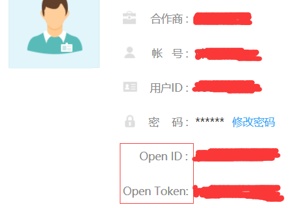
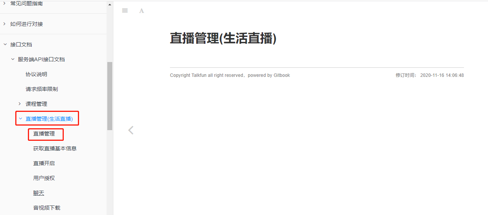
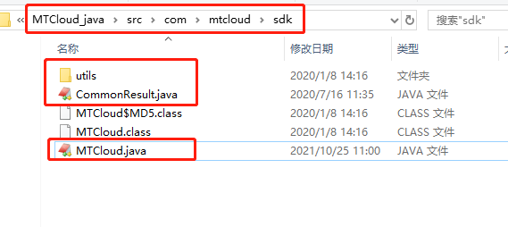

## 硅谷课堂第十四天-直播管理模块

[TOC]

### 一、后台系统-直播管理

上面我们已经开通了“生活类直播”。

#### 1、获取openId与openToken

登录进入开放后台，后台首页即可获取openId与openToken



#### 2、对接说明

1、使用HTTP协议进行信息交互，字符编码统一采用UTF-8

2、除非特殊说明，接口地址统一为：https://api.talk-fun.com/portal.php

3、除非特殊说明，同时支持GET和POST两种参数传递方式

4、除非特殊说明，返回信息支持JSON格式

5、除了sign外，其余所有请求参数值都需要进行URL编码

6、参数表中，类型一栏声明的定义为：int 代表整数类型；string 代表字符串类型，如果后面有括号，括号中的数字代表该参数的最大长度；array/object表示数组类型

7、openID、openToken参数的获取见[对接流程说明](https://open.talk-fun.com/docs/getstartV2/quickStart.html)

#### 3、了解接口文档

接口文档地址：https://open.talk-fun.com/docs/getstartV2/api/live_dir.html

##### 3.1、了解接口文档

根据接口文档，了解我们需要对接哪些接口



###### （1）添加直播

api名称：`course.add`，SDK对应方法：`courseAdd`

添加直播是一定需要的

###### （2）更新直播信息

api名称：`course.update`，SDK对应方法`courseUpdate`

###### （3）删除直播信息

api名称：`course.delete`，SDK对应方法：`courseDelete`

###### （4）修改生活直播相关配置

api名称：`course.updateLifeConfig`，SDK对应方法：`updateLifeConfig`

设置功能很多，但是我们只需要几个即可，这个接口我们需要做如下设置：

​	1、**界面模式**：pageViewMode 界面模式 1全屏模式 0二分屏 2课件模式

​	2、**观看人数开关**：number 观看人数开关；number.enable 是否开启 观看人数 0否 1是；示例：{"enable":"1"}

​	3、**商城开关**（直播推荐课程）：goodsListEdit 商品列表编辑，状态goodsListEdit.status 0覆盖，1追加，不传默认为0；示例：{"status":1}；

直播设置最终效果：


###### （5）按照课程ID获取访客列表

改接口在："访客/管理员列表"下面

通过该接口统计课程观看人数信息

**直播**访客api名称：`course.visitor.list`，SDK对应方法：`courseVisitorList`

##### 3.2、下载SDK

直播平台为我们准备了SDK，我们直接使用

下载地址：https://open.talk-fun.com/docs/getstartV2/api/introduce/sdkdownload.html

已下载：当前目录/MTCloud-java-sdk-1.6.zip


#### 5、搭建service_live模块

##### 5.1、创建service_live模块


##### 5.2、添加依赖

**添加直播SDK需要的依赖**

```xml
<!-- 直播  -->
<dependency>
    <groupId>commons-httpclient</groupId>
    <artifactId>commons-httpclient</artifactId>
    <version>3.0.1</version>
</dependency>
<dependency>
    <groupId>net.sf.json-lib</groupId>
    <artifactId>json-lib</artifactId>
    <version>2.4</version>
    <classifier>jdk15</classifier>
</dependency>
```

##### 5.3、集成代码

解压MTCloud-java-sdk-1.6.zip，复制MTCloud-java-sdk-1.6\MTCloud_java\src\com\mtcloud\sdk下面的java文件到com.atguigu.ggkt.live.mtcloud包下，如图




##### 5.4、更改配置

更改MTCloud类配置

说明：

​	1、更改openID与openToken

​	2、该类官方已经做了接口集成，我们可以直接使用。

```java
public class MTCloud {

    /**
     * 合作方ID： 合作方在欢拓平台的唯一ID
     */
    public String openID = "37013";

    /**
     * 合作方秘钥： 合作方ID对应的参数加密秘钥
     */
    public String openToken = "5cfa64c1be5f479aea8296bb4e2c37d3";
    
    ...
}
```

##### 5.5、创建配置文件和启动类

**（1）application.properties**

```properties
# 服务端口
server.port=8306
# 服务名
spring.application.name=service-live

# 环境设置：dev、test、prod
spring.profiles.active=dev

# mysql数据库连接
spring.datasource.driver-class-name=com.mysql.jdbc.Driver
spring.datasource.url=jdbc:mysql://localhost:3306/glkt_live?characterEncoding=utf-8&useSSL=false
spring.datasource.username=root
spring.datasource.password=root

#返回json的全局时间格式
spring.jackson.date-format=yyyy-MM-dd HH:mm:ss
spring.jackson.time-zone=GMT+8

#mybatis日志
mybatis-plus.configuration.log-impl=org.apache.ibatis.logging.stdout.StdOutImpl

mybatis-plus.mapper-locations=classpath:com/atguigu/ggkt/live/mapper/xml/*.xml

# nacos服务地址
spring.cloud.nacos.discovery.server-addr=127.0.0.1:8848

mtcloud.openId=43873
mtcloud.openToken=1f3681df876eb31474be8c479b9f1ffe
```

**（2）启动类**

```java
@SpringBootApplication
@EnableDiscoveryClient
@EnableFeignClients(basePackages = "com.atguigu")
@ComponentScan(basePackages = "com.atguigu")
@MapperScan("com.atguigu.ggkt.live.mapper")
public class ServiceLiveApplication {

    public static void main(String[] args) {
        SpringApplication.run(ServiceLiveApplication.class, args);
    }

}
```

##### 5.6、生成相关代码


#### 6、功能实现-直播课程列表接口


根据直播平台与我们自身业务设计直播相关的业务表，如：glkt_live

##### 6.1、LiveCourseController类

```java
@RestController
@RequestMapping(value="/admin/live/liveCourse")
public class LiveCourseController {

    @Autowired
    private LiveCourseService liveCourseService;

    @Autowired
    private LiveCourseAccountService liveCourseAccountService;

    @ApiOperation(value = "获取分页列表")
    @GetMapping("{page}/{limit}")
    public Result index(
            @ApiParam(name = "page", value = "当前页码", required = true)
            @PathVariable Long page,
            @ApiParam(name = "limit", value = "每页记录数", required = true)
            @PathVariable Long limit) {
        Page<LiveCourse> pageParam = new Page<>(page, limit);
        IPage<LiveCourse> pageModel = liveCourseService.selectPage(pageParam);
        return Result.ok(pageModel);
    }
}
```

##### 6.2、LiveCourseService接口

```java
public interface LiveCourseService extends IService<LiveCourse> {
    //直播课程分页查询
    IPage<LiveCourse> selectPage(Page<LiveCourse> pageParam);
}
```

##### 6.3、service_vod模块创建接口

**（1）获取讲师信息**


```java
@ApiOperation("根据id查询")
@GetMapping("inner/getTeacher/{id}")
public Teacher getTeacherLive(@PathVariable Long id) {
    Teacher teacher = teacherService.getById(id);
    return teacher;
}
```

**（2）service_course_client定义接口**


```java
@GetMapping("/admin/vod/teacher/inner/getTeacher/{id}")
Teacher getTeacherLive(@PathVariable Long id);
```

##### 6.4、service_live引入依赖

```xml
<dependency>
    <groupId>com.atguigu</groupId>
    <artifactId>service_course_client</artifactId>
    <version>0.0.1-SNAPSHOT</version>
</dependency>
```

##### 6.5、LiveCourseServiceImpl实现

```java
@Service
public class LiveCourseServiceImpl extends ServiceImpl<LiveCourseMapper, LiveCourse> implements LiveCourseService {

    @Autowired
    private CourseFeignClient courseFeignClient;
    
    //直播课程分页查询
    @Override
    public IPage<LiveCourse> selectPage(Page<LiveCourse> pageParam) {
        IPage<LiveCourse> page = baseMapper.selectPage(pageParam, null);
        List<LiveCourse> liveCourseList = page.getRecords();

        for(LiveCourse liveCourse : liveCourseList) {
            Teacher teacher = courseFeignClient.getTeacherLive(liveCourse.getTeacherId());
            liveCourse.getParam().put("teacherName", teacher.getName());
            liveCourse.getParam().put("teacherLevel", teacher.getLevel());
        }
        return page;
    }
}
```


#### 7、功能实现-直播课程添加接口


##### 7.1、添加工具类


**（1）MTCloudAccountConfig类**

```java
@Data
@Component
@ConfigurationProperties(prefix = "mtcloud")
public class MTCloudAccountConfig {

    private String openId;
    private String openToken;

}
```

**（2）MTCloudConfig类**

```java
@Component
public class MTCloudConfig {

    @Autowired
    private MTCloudAccountConfig mtCloudAccountConfig;

    @Bean
    public MTCloud mtCloudClient(){
        return new MTCloud(mtCloudAccountConfig.getOpenId(), mtCloudAccountConfig.getOpenToken());
    }
}
```

##### 7.2、LiveCourseController类

```java
@ApiOperation(value = "新增")
@PostMapping("save")
public Result save(@RequestBody LiveCourseFormVo liveCourseVo) {
    liveCourseService.save(liveCourseVo);
    return Result.ok(null);
}
```

##### 7.3、LiveCourseService接口

```java
Boolean save(LiveCourseFormVo liveCourseVo);
```

##### 7.4、LiveCourseServiceImpl实现

```java
@Resource
private LiveCourseAccountService liveCourseAccountService;

@Resource
private LiveCourseDescriptionService liveCourseDescriptionService;

@Autowired
private CourseFeignClient teacherFeignClient;

@Resource
private MTCloud mtCloudClient;
@SneakyThrows
@Transactional(rollbackFor = {Exception.class})
@Override
public Boolean save(LiveCourseFormVo liveCourseFormVo) {
    LiveCourse liveCourse = new LiveCourse();
    BeanUtils.copyProperties(liveCourseFormVo, liveCourse);

    Teacher teacher = teacherFeignClient.getTeacherLive(liveCourseFormVo.getTeacherId());
    HashMap<Object, Object> options = new HashMap<>();
    options.put("scenes", 2);//直播类型。1: 教育直播，2: 生活直播。默认 1，说明：根据平台开通的直播类型填写
    options.put("password", liveCourseFormVo.getPassword());
    String res = mtCloudClient.courseAdd(liveCourse.getCourseName(), teacher.getId().toString(), new DateTime(liveCourse.getStartTime()).toString("yyyy-MM-dd HH:mm:ss"), new DateTime(liveCourse.getEndTime()).toString("yyyy-MM-dd HH:mm:ss"), teacher.getName(), teacher.getIntro(), options);

    System.out.println("return:: "+res);
    CommonResult<JSONObject> commonResult = JSON.parseObject(res, CommonResult.class);
    if(Integer.parseInt(commonResult.getCode()) == MTCloud.CODE_SUCCESS) {
        JSONObject object = commonResult.getData();
        liveCourse.setCourseId(object.getLong("course_id"));
        baseMapper.insert(liveCourse);

        //保存课程详情信息
        LiveCourseDescription liveCourseDescription = new LiveCourseDescription();
        liveCourseDescription.setDescription(liveCourseFormVo.getDescription());
        liveCourseDescription.setLiveCourseId(liveCourse.getId());
        liveCourseDescriptionService.save(liveCourseDescription);

        //保存课程账号信息
        LiveCourseAccount liveCourseAccount = new LiveCourseAccount();
        liveCourseAccount.setLiveCourseId(liveCourse.getId());
        liveCourseAccount.setZhuboAccount(object.getString("bid"));
        liveCourseAccount.setZhuboPassword(liveCourseFormVo.getPassword());
        liveCourseAccount.setAdminKey(object.getString("admin_key"));
        liveCourseAccount.setUserKey(object.getString("user_key"));
        liveCourseAccount.setZhuboKey(object.getString("zhubo_key"));
        liveCourseAccountService.save(liveCourseAccount);
    } else {
        String getmsg = commonResult.getmsg();
        throw new GlktException(20001,getmsg);
    }
    return true;
}
```


#### 8、功能实现-直播课程删除接口


##### 8.1、LiveCourseController类

```java
@ApiOperation(value = "删除")
@DeleteMapping("remove/{id}")
public Result remove(@PathVariable Long id) {
    liveCourseService.removeLive(id);
    return Result.ok(null);
}
```

##### 8.2、LiveCourseService接口

```java
//删除直播课程
void removeLive(Long id);
```

##### 8.3、LiveCourseServiceImpl实现

```java
//删除直播课程
@Override
public void removeLive(Long id) {
    //根据id查询直播课程信息
    LiveCourse liveCourse = baseMapper.selectById(id);
    if(liveCourse != null) {
        //获取直播courseid
        Long courseId = liveCourse.getCourseId();
        try {
            //调用方法删除平台直播课程
            mtCloudClient.courseDelete(courseId.toString());
            //删除表数据
            baseMapper.deleteById(id);
        } catch (Exception e) {
            e.printStackTrace();
            throw new GgktException(20001,"删除直播课程失败");
        }
    }
}
```


#### 9、功能实现-直播课程修改接口


##### 9.1、LiveCourseController类

```java
@ApiOperation(value = "获取")
@GetMapping("get/{id}")
public Result<LiveCourse> get(@PathVariable Long id) {
    LiveCourse liveCourse = liveCourseService.getById(id);
    return Result.ok(liveCourse);
}

@ApiOperation(value = "获取")
@GetMapping("getInfo/{id}")
public Result<LiveCourseFormVo> getInfo(@PathVariable Long id) {
    return Result.ok(liveCourseService.getLiveCourseFormVo(id));
}

@ApiOperation(value = "修改")
@PutMapping("update")
public Result updateById(@RequestBody LiveCourseFormVo liveCourseVo) {
    liveCourseService.updateById(liveCourseVo);
    return Result.ok(null);
}
```

##### 9.2、LiveCourseService接口

```java
//修改
void updateById(LiveCourseFormVo liveCourseVo);

//获取
LiveCourseFormVo getLiveCourseFormVo(Long id);
```

##### 9.3、LiveCourseServiceImpl实现

```java
@Resource
private LiveCourseAccountService liveCourseAccountService;

@Resource
private LiveCourseDescriptionService liveCourseDescriptionService;

@Autowired
private CourseFeignClient teacherFeignClient;

@Resource
private MTCloud mtCloudClient;

//更新
@Override
public void updateLiveById(LiveCourseFormVo liveCourseFormVo) {
    //根据id获取直播课程基本信息
    LiveCourse liveCourse = baseMapper.selectById(liveCourseFormVo.getId());
    BeanUtils.copyProperties(liveCourseFormVo,liveCourse);
    //讲师
    Teacher teacher =
            teacherFeignClient.getTeacherInfo(liveCourseFormVo.getTeacherId());

//             *   course_id 课程ID
//     *   account 发起直播课程的主播账号
//     *   course_name 课程名称
//     *   start_time 课程开始时间,格式:2015-01-01 12:00:00
//                *   end_time 课程结束时间,格式:2015-01-01 13:00:00
//                *   nickname 	主播的昵称
//                *   accountIntro 	主播的简介
//                *  options 		可选参数
    HashMap<Object, Object> options = new HashMap<>();
    try {
        String res = mtCloudClient.courseUpdate(liveCourse.getCourseId().toString(),
                teacher.getId().toString(),
                liveCourse.getCourseName(),
                new DateTime(liveCourse.getStartTime()).toString("yyyy-MM-dd HH:mm:ss"),
                new DateTime(liveCourse.getEndTime()).toString("yyyy-MM-dd HH:mm:ss"),
                teacher.getName(),
                teacher.getIntro(),
                options);
        //返回结果转换，判断是否成功
        CommonResult<JSONObject> commonResult = JSON.parseObject(res, CommonResult.class);
        if(Integer.parseInt(commonResult.getCode()) == MTCloud.CODE_SUCCESS) {
            JSONObject object = commonResult.getData();
            //更新直播课程基本信息
            liveCourse.setCourseId(object.getLong("course_id"));
            baseMapper.updateById(liveCourse);
            //直播课程描述信息更新
            LiveCourseDescription liveCourseDescription =
                    liveCourseDescriptionService.getLiveCourseById(liveCourse.getId());
            liveCourseDescription.setDescription(liveCourseFormVo.getDescription());
            liveCourseDescriptionService.updateById(liveCourseDescription);
        } else {
            throw new GgktException(20001,"修改直播课程失败");
        }
    } catch (Exception e) {
        e.printStackTrace();
    }
}

@Override
public LiveCourseFormVo getLiveCourseFormVo(Long id) {
    LiveCourse liveCourse = this.getById(id);
    LiveCourseDescription liveCourseDescription = liveCourseDescriptionService.getByLiveCourseId(id);

    LiveCourseFormVo liveCourseFormVo = new LiveCourseFormVo();
    BeanUtils.copyProperties(liveCourse, liveCourseFormVo);
    liveCourseFormVo.setDescription(liveCourseDescription.getDescription());
    return liveCourseFormVo;
}
```

##### 9.4、LiveCourseDescriptionService添加方法

```java
public interface LiveCourseDescriptionService extends IService<LiveCourseDescription> {
    LiveCourseDescription getByLiveCourseId(Long liveCourseId);
}
```

##### 9.5、LiveCourseDescriptionServiceImpl实现方法

```java
@Service
public class LiveCourseDescriptionServiceImpl extends ServiceImpl<LiveCourseDescriptionMapper, LiveCourseDescription> implements LiveCourseDescriptionService {

    @Override
    public LiveCourseDescription getByLiveCourseId(Long liveCourseId) {
        return this.getOne(new LambdaQueryWrapper<LiveCourseDescription>().eq(LiveCourseDescription::getLiveCourseId, liveCourseId));
    }
}
```


#### 10、功能实现-查看账号接口


##### 10.1、LiveCourseController类

```java
@Autowired
private LiveCourseAccountService liveCourseAccountService;

@ApiOperation(value = "获取")
@GetMapping("getLiveCourseAccount/{id}")
public Result<LiveCourseAccount> getLiveCourseAccount(@PathVariable Long id) {
    return Result.ok(liveCourseAccountService.getByLiveCourseId(id));
}
```

##### 10.2、LiveCourseAccountService接口

```java
public interface LiveCourseAccountService extends IService<LiveCourseAccount> {
    LiveCourseAccount getByLiveCourseId(Long liveCourseId);
}
```

##### 10.3、LiveCourseAccountServiceImpl实现

```java
@Service
public class LiveCourseAccountServiceImpl extends ServiceImpl<LiveCourseAccountMapper, LiveCourseAccount> implements LiveCourseAccountService {

    @Override
    public LiveCourseAccount getByLiveCourseId(Long liveCourseId) {
        return baseMapper.selectOne(new LambdaQueryWrapper<LiveCourseAccount>().eq(LiveCourseAccount::getLiveCourseId, liveCourseId));
    }
}
```


#### 11、功能实现-配置和观看记录接口


##### 11.1、查看配置信息

**（1）LiveCourseController类**

```java
@ApiOperation(value = "获取")
@GetMapping("getCourseConfig/{id}")
public Result getCourseConfig(@PathVariable Long id) {
    return Result.ok(liveCourseService.getCourseConfig(id));
}
```

**（2）LiveCourseService添加方法**

```java
//获取配置
LiveCourseConfigVo getCourseConfig(Long id);
```

**（3）LiveCourseServiceImpl实现**

```java
@Autowired
private LiveCourseConfigService liveCourseConfigService;

@Autowired
private LiveCourseGoodsService liveCourseGoodsService;

@Override
public LiveCourseConfigVo getCourseConfig(Long id) {
    LiveCourseConfigVo liveCourseConfigVo = new LiveCourseConfigVo();
    LiveCourseConfig liveCourseConfig = liveCourseConfigService.getByLiveCourseId(id);
    if(null != liveCourseConfig) {
        List<LiveCourseGoods> liveCourseGoodsList = liveCourseGoodsService.findByLiveCourseId(id);
        BeanUtils.copyProperties(liveCourseConfig, liveCourseConfigVo);
        liveCourseConfigVo.setLiveCourseGoodsList(liveCourseGoodsList);
    }
    return liveCourseConfigVo;
}
```

**（4）LiveCourseConfigService添加方法**

```java
public interface LiveCourseConfigService extends IService<LiveCourseConfig> {
    //查看配置信息
    LiveCourseConfig getByLiveCourseId(Long id);
}
```

**（5）LiveCourseConfigServiceImpl实现方法**

```java
@Service
public class LiveCourseConfigServiceImpl extends ServiceImpl<LiveCourseConfigMapper, LiveCourseConfig> implements LiveCourseConfigService {

    //查看配置信息
    @Override
    public LiveCourseConfig getByLiveCourseId(Long liveCourseId) {
        return baseMapper.selectOne(new LambdaQueryWrapper<LiveCourseConfig>().eq(
                LiveCourseConfig::getLiveCourseId,
                liveCourseId));
    }
}
```

**（6）LiveCourseGoodsService添加方法**

```java
public interface LiveCourseGoodsService extends IService<LiveCourseGoods> {
    //获取课程商品列表
    List<LiveCourseGoods> findByLiveCourseId(Long id);
}
```

**（7）LiveCourseGoodsServiceImpl实现方法**

```java
@Service
public class LiveCourseGoodsServiceImpl extends ServiceImpl<LiveCourseGoodsMapper, LiveCourseGoods> implements LiveCourseGoodsService {

    //获取课程商品列表
    @Override
    public List<LiveCourseGoods> findByLiveCourseId(Long liveCourseId) {
        return baseMapper.selectList(new LambdaQueryWrapper<LiveCourseGoods>()
                .eq(LiveCourseGoods::getLiveCourseId, liveCourseId));
    }
}
```


##### 11.2、修改直播配置信息

**（1）LiveCourseController添加方法**

```java
@ApiOperation(value = "修改配置")
@PutMapping("updateConfig")
public Result updateConfig(@RequestBody LiveCourseConfigVo liveCourseConfigVo) {
    liveCourseService.updateConfig(liveCourseConfigVo);
    return Result.ok(null);
}
```

**（2）LiveCourseService添加方法**

```java
//修改配置
void updateConfig(LiveCourseConfigVo liveCourseConfigVo);
```

**（3）LiveCourseServiceImpl实现方法**

```java
@Override
public void updateConfig(LiveCourseConfigVo liveCourseConfigVo) {
    LiveCourseConfig liveCourseConfigUpt = new LiveCourseConfig();
    BeanUtils.copyProperties(liveCourseConfigVo, liveCourseConfigUpt);
    if(null == liveCourseConfigVo.getId()) {
        liveCourseConfigService.save(liveCourseConfigUpt);
    } else {
        liveCourseConfigService.updateById(liveCourseConfigUpt);
    }
    liveCourseGoodsService.remove(new LambdaQueryWrapper<LiveCourseGoods>().eq(LiveCourseGoods::getLiveCourseId, liveCourseConfigVo.getLiveCourseId()));
    if(!CollectionUtils.isEmpty(liveCourseConfigVo.getLiveCourseGoodsList())) {
        liveCourseGoodsService.saveBatch(liveCourseConfigVo.getLiveCourseGoodsList());
    }
    this.updateLifeConfig(liveCourseConfigVo);
}
/**
 * 上传直播配置
 * @param liveCourseConfigVo
 */
@SneakyThrows
private void updateLifeConfig(LiveCourseConfigVo liveCourseConfigVo) {
    LiveCourse liveCourse = this.getById(liveCourseConfigVo.getLiveCourseId());

    //参数设置
    HashMap<Object,Object> options = new HashMap<Object, Object>();
    //界面模式
    options.put("pageViewMode", liveCourseConfigVo.getPageViewMode());
    //观看人数开关
    JSONObject number = new JSONObject();
    number.put("enable", liveCourseConfigVo.getNumberEnable());
    options.put("number", number.toJSONString());
    //观看人数开关
    JSONObject store = new JSONObject();
    number.put("enable", liveCourseConfigVo.getStoreEnable());
    number.put("type", liveCourseConfigVo.getStoreType());
    options.put("store", number.toJSONString());
    //商城列表
    List<LiveCourseGoods> liveCourseGoodsList = liveCourseConfigVo.getLiveCourseGoodsList();
    if(!CollectionUtils.isEmpty(liveCourseGoodsList)) {
        List<LiveCourseGoodsView> liveCourseGoodsViewList = new ArrayList<>();
        for(LiveCourseGoods liveCourseGoods : liveCourseGoodsList) {
            LiveCourseGoodsView liveCourseGoodsView = new LiveCourseGoodsView();
            BeanUtils.copyProperties(liveCourseGoods, liveCourseGoodsView);
            liveCourseGoodsViewList.add(liveCourseGoodsView);
        }
        JSONObject goodsListEdit = new JSONObject();
        goodsListEdit.put("status", "0");
        options.put("goodsListEdit ", goodsListEdit.toJSONString());
        options.put("goodsList", JSON.toJSONString(liveCourseGoodsViewList));
    }
    
    String res = mtCloudClient.courseUpdateLifeConfig(liveCourse.getCourseId().toString(), options);

    CommonResult<JSONObject> commonResult = JSON.parseObject(res, CommonResult.class);
    if(Integer.parseInt(commonResult.getCode()) != MTCloud.CODE_SUCCESS) {
        throw new GgktException(20001,"修改配置信息失败");
    }
}
```


##### 11.3、获取最近直播课程

**（1）LiveCourseController添加方法**

```java
@ApiOperation(value = "获取最近的直播")
@GetMapping("findLatelyList")
public Result findLatelyList() {
    return Result.ok(liveCourseService.findLatelyList());
}
```

**（2）LiveCourseService添加方法**

```java
//获取最近的直播
List<LiveCourseVo> findLatelyList();
```

**（3）LiveCourseServiceImpl实现方法**

```java
@Override
public List<LiveCourseVo> findLatelyList() {
    List<LiveCourseVo> liveCourseVoList = baseMapper.findLatelyList();

    for(LiveCourseVo liveCourseVo : liveCourseVoList) {
        liveCourseVo.setStartTimeString(new DateTime(liveCourseVo.getStartTime()).toString("yyyy年MM月dd HH:mm"));
        liveCourseVo.setEndTimeString(new DateTime(liveCourseVo.getEndTime()).toString("HH:mm"));

        Long teacherId = liveCourseVo.getTeacherId();
        Teacher teacher = teacherFeignClient.getTeacherInfo(teacherId);
        liveCourseVo.setTeacher(teacher);

        liveCourseVo.setLiveStatus(this.getLiveStatus(liveCourseVo));
    }
    return liveCourseVoList;
}

/**
 * 直播状态 0：未开始 1：直播中 2：直播结束
 * @param liveCourse
 * @return
 */
private int getLiveStatus(LiveCourse liveCourse) {
    // 直播状态 0：未开始 1：直播中 2：直播结束
    int liveStatus = 0;
    Date curTime = new Date();
    if(DateUtil.dateCompare(curTime, liveCourse.getStartTime())) {
        liveStatus = 0;
    } else if(DateUtil.dateCompare(curTime, liveCourse.getEndTime())) {
        liveStatus = 1;
    } else {
        liveStatus = 2;
    }
    return liveStatus;
}
```

**（4）LiveCourseMapper添加方法**

```java
public interface LiveCourseMapper extends BaseMapper<LiveCourse> {
    //获取最近直播
    List<LiveCourseVo> findLatelyList();
}
```

**（5）LiveCourseMapper.xml编写sql语句**

```xml
<?xml version="1.0" encoding="UTF-8"?>
<!DOCTYPE mapper PUBLIC "-//mybatis.org//DTD Mapper 3.0//EN" "http://mybatis.org/dtd/mybatis-3-mapper.dtd">
<mapper namespace="com.atguigu.ggkt.live.mapper.LiveCourseMapper">
    <resultMap id="liveCourseMap" type="com.atguigu.ggkt.vo.live.LiveCourseVo" autoMapping="true">
    </resultMap>

    <!-- 用于select查询公用抽取的列 -->
    <sql id="columns">
id,course_id,course_name,start_time,end_time,teacher_id,cover,create_time,update_time,is_deleted
	</sql>

    <select id="findLatelyList" resultMap="liveCourseMap">
        select <include refid="columns" />
        from live_course
        where date(start_time) >= curdate()
        order by id asc
        limit 5
    </select>
</mapper>
```

