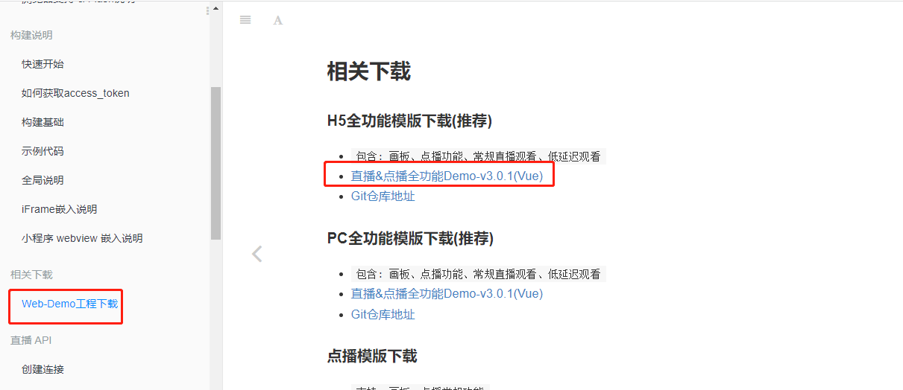

## 硅谷课堂第十五天-直播管理模块和微信分享

[TOC]

### 一、后台系统-直播管理模块

#### 1、直播课程管理前端整合

##### 1.1、service_vod添加方法

**（1）CourseController添加方法**

```java
@GetMapping("findAll")
public Result findAll() {
    List<Course> list = courseService.findlist();
    return Result.ok(list);
}
```

**（2）CourseService实现方法**

```java
@Override
public List<Course> findlist() {
    List<Course> list = baseMapper.selectList(null);
    list.stream().forEach(item -> {
        this.getTeacherAndSubjectName(item);
    });
    return list;
}
```


##### 1.2、router->index.js路由

```js
{
  path: '/live',
  component: Layout,
  redirect: '/live/liveCourse/list',
  name: 'Live',
  meta: {
    title: '直播管理',
    icon: 'el-icon-bangzhu'
  },
  alwaysShow: true,
  children: [
    {
      path: 'liveCourse/list',
      name: 'liveCourseList',
      component: () => import('@/views/live/liveCourse/list'),
      meta: { title: '直播列表' }
    },
    {
      path: 'liveCourse/config/:id',
      name: 'liveCourseConfig',
      component: () => import('@/views/live/liveCourse/config'),
      meta: { title: '直播配置' },
      hidden: true
    },
    {
      path: 'liveVisitor/list/:id',
      name: 'liveVisitor',
      component: () => import('@/views/live/liveVisitor/list'),
      meta: { title: '观看记录' },
      hidden: true
    }
  ]
},
```


##### 1.3、定义调用接口


```js
import request from '@/utils/request'

const api_name = '/admin/live/liveCourse'

export default {

  getPageList(page, limit) {
    return request({
      url: `${api_name}/${page}/${limit}`,
      method: 'get'
    })
  },

  findLatelyList() {
    return request({
      url: `${api_name}/findLatelyList`,
      method: 'get'
    })
  },

  getById(id) {
    return request({
      url: `${api_name}/getInfo/${id}`,
      method: 'get'
    })
  },

  getLiveCourseAccount(id) {
    return request({
      url: `${api_name}/getLiveCourseAccount/${id}`,
      method: 'get'
    })
  },

  save(liveCourse) {
    return request({
      url: `${api_name}/save`,
      method: 'post',
      data: liveCourse
    })
  },

  updateById(liveCourse) {
    return request({
      url: `${api_name}/update`,
      method: 'put',
      data: liveCourse
    })
  },
  removeById(id) {
    return request({
      url: `${api_name}/remove/${id}`,
      method: 'delete'
    })
  },
  removeRows(idList) {
    return request({
      url: `${api_name}/batchRemove`,
      method: 'delete',
      data: idList
    })
  },

  getCourseConfig(id) {
    return request({
      url: `${api_name}/getCourseConfig/${id}`,
      method: 'get'
    })
  },

  updateConfig(liveCourseConfigVo) {
    return request({
      url: `${api_name}/updateConfig`,
      method: 'put',
      data: liveCourseConfigVo
    })
  },
}
```


```js
findAll() {
  return request({
    url: `${api_name}/findAll`,
    method: 'get'
  })
},
```


##### 1.4、创建直播页面


##### （1）list.vue

```vue
<template>
  <div class="app-container">

    <!-- 工具条 -->
    <el-card class="operate-container" shadow="never">
      <i class="el-icon-tickets" style="margin-top: 5px"></i>
      <span style="margin-top: 5px">数据列表</span>
      <el-button class="btn-add" size="mini" @click="add">添 加</el-button>
    </el-card>

    <!-- banner列表 -->
    <el-table
      v-loading="listLoading"
      :data="list"
      stripe
      border
      style="width: 100%;margin-top: 10px;">

      <el-table-column
        label="序号"
        width="50"
        align="center">
        <template slot-scope="scope">
          {{ (page - 1) * limit + scope.$index + 1 }}
        </template>
      </el-table-column>
      <el-table-column label="封面" width="200" align="center">
        <template slot-scope="scope">
          
        </template>
      </el-table-column>
      <el-table-column prop="courseName" label="直播名称" />
      <el-table-column prop="startTime" label="直播时间">
        <template slot-scope="scope">
          {{ scope.row.param.startTimeString }}至{{ scope.row.param.endTimeString }}
        </template>
      </el-table-column>
      <el-table-column prop="endTime" label="直播结束时间" />
      <el-table-column prop="param.teacherName" label="直播老师" />
      <el-table-column label="头衔" width="90">
        <template slot-scope="scope">
          <el-tag v-if="scope.row.param.teacherLevel === 1" type="success" size="mini">高级讲师</el-tag>
          <el-tag v-if="scope.row.param.teacherLevel === 0" size="mini">首席讲师</el-tag>
        </template>
      </el-table-column>
      <el-table-column prop="createTime" label="创建时间" />

      <el-table-column label="操作" width="200" align="center">
        <template slot-scope="scope">
          <el-button type="text" size="mini" @click="edit(scope.row.id)">修改</el-button>
          <el-button type="text" size="mini" @click="removeDataById(scope.row.id)">删除</el-button>
          <el-button type="text" size="mini" @click="showAccount(scope.row)">查看账号</el-button>
          <router-link :to="'/live/liveCourse/config/'+scope.row.id">
            <el-button type="text" size="mini">配置</el-button>
          </router-link>
          <router-link :to="'/live/liveVisitor/list/'+scope.row.id">
            <el-button type="text" size="mini">观看记录</el-button>
          </router-link>
        </template>
      </el-table-column>
    </el-table>

    <!-- 分页组件 -->
    <el-pagination
      :current-page="page"
      :total="total"
      :page-size="limit"
      :page-sizes="[5, 10, 20, 30, 40, 50, 100]"
      style="padding: 30px 0; text-align: center;"
      layout="sizes, prev, pager, next, jumper, ->, total, slot"
      @current-change="fetchData"
      @size-change="changeSize"
    />

    <el-dialog title="添加/修改" :visible.sync="dialogVisible" width="60%" >
      <el-form ref="flashPromotionForm" label-width="150px" size="small" style="padding-right: 40px;">
        <!-- 课程讲师 -->
        <el-form-item label="直播讲师">
          <el-select
            v-model="liveCourse.teacherId"
            placeholder="请选择">
            <el-option
              v-for="teacher in teacherList"
              :key="teacher.id"
              :label="teacher.name"
              :value="teacher.id"/>
          </el-select>
        </el-form-item>
        <el-form-item label="直播讲师登录密码" v-if="liveCourse.id === ''">
          <el-input v-model="liveCourse.password"/>
        </el-form-item>
        <el-form-item label="直播名称">
          <el-input v-model="liveCourse.courseName"/>
        </el-form-item>
        <el-form-item label="直播开始时间">
          <el-date-picker
            v-model="liveCourse.startTime"
            type="datetime"
            placeholder="选择开始日期"
            value-format="yyyy-MM-dd HH:mm:ss" />
        </el-form-item>
        <el-form-item label="直播结束时间">
          <el-date-picker
            v-model="liveCourse.endTime"
            type="datetime"
            placeholder="选择结束日期"
            value-format="yyyy-MM-dd HH:mm:ss" />
        </el-form-item>
        <el-form-item label="直播封面">
          <el-upload
            :show-file-list="false"
            :on-success="handleCoverSuccess"
            :before-upload="beforeCoverUpload"
            :on-error="handleCoverError"
            :action="BASE_API+'/admin/vod/file/upload?module=cover'"
            class="cover-uploader">
            
            <i v-else class="el-icon-plus avatar-uploader-icon"/>
          </el-upload>
        </el-form-item>
        <el-form-item label="直播详情">
          <el-input v-model="liveCourse.description" type="textarea" rows="5"/>
        </el-form-item>
      </el-form>
      <span slot="footer" class="dialog-footer">
        <el-button @click="dialogVisible = false" size="small">取 消</el-button>
        <el-button type="primary" @click="saveOrUpdate()" size="small">确 定</el-button>
      </span>
    </el-dialog>

    <el-dialog title="查看账号" :visible.sync="accountDialogVisible" width="60%" >
      <el-form ref="accountForm" label-width="150px" size="small" style="padding-right: 40px;">
        <div style="margin-left: 40px;">
          <h4>主播帮助信息</h4>
          <el-row style="height:35px;">
            <el-co >
              <span class="spd-info">主播登录链接：</span>
              <span class="spd-info">https://live.zhibodun.com/live/courseLogin.php?course_id={{ liveCourseAccount.courseId }}&role=admin</span>
            </el-co>
          </el-row>
          <el-row style="height:35px;">
            <el-col >
              <span class="spd-info">主播登录密码：{{ liveCourseAccount.zhuboKey }}</span>
            </el-col>
          </el-row>
        </div>
        <div style="margin-left: 40px;">
          <h4>主播客户端账号信息</h4>
          <el-row style="height:35px;">
            <el-col >
              <span class="spd-info">主播登录账户：{{ liveCourseAccount.zhuboAccount }}</span>
            </el-col>
          </el-row>
          <el-row style="height:35px;">
            <el-col >
              <span class="spd-info">主播登录密码：{{ liveCourseAccount.zhuboPassword }}</span>
            </el-col>
          </el-row>
        </div>

        <div style="margin-left: 40px;">
          <h4>助教信息</h4>
          <el-row style="height:35px;">
            <el-co >
              <span class="spd-info">助教登录连接：</span>
              <span class="spd-info">https://live.zhibodun.com/live/courseLogin.php?course_id={{ liveCourseAccount.courseId }}&role=admin</span>
            </el-co>
          </el-row>
          <el-row style="height:35px;">
            <el-col>
              <span class="spd-info">主播登录密码：{{ liveCourseAccount.adminKey }}</span>
            </el-col>
          </el-row>
        </div>
        <div style="margin-left: 40px;">
          <h4>学生观看信息</h4>
          <el-row style="height:35px;">
            <el-co >
              <span class="spd-info">观看连接：</span>
              <span class="spd-info">http://glkt-api.atguigu.cn/#/liveInfo/{{ liveCourseAccount.courseId }}</span>
            </el-co>
          </el-row>
          <el-row style="height:35px;">
            <el-col>
              <span class="spd-info">观看二维码：</span>
            </el-col>
          </el-row>
        </div>
      </el-form>
      <span slot="footer" class="dialog-footer">
        <el-button @click="accountDialogVisible = false" size="small">关 闭</el-button>
      </span>
    </el-dialog>
  </div>
</template>

<script>
import api from '@/api/live/liveCourse'
import teacherApi from '@/api/vod/teacher'

const defaultForm = {
  id: '',
  courseName: '',
  startTime: '',
  endTime: '',
  teacherId: '',
  password: '',
  description: '',
  cover: 'https://cdn.uviewui.com/uview/swiper/1.jpg'
}
export default {
  data() {
    return {
      BASE_API: 'http://localhost:8333',
      listLoading: true, // 数据是否正在加载
      list: null, // banner列表
      total: 0, // 数据库中的总记录数
      page: 1, // 默认页码
      limit: 10, // 每页记录数
      searchObj: {}, // 查询表单对象

      teacherList: [], // 讲师列表

       dialogVisible: false,
       liveCourse: defaultForm,
       saveBtnDisabled: false,

      accountDialogVisible: false,
      liveCourseAccount: {
        courseId: ''
      }
    }
  },

  // 生命周期函数：内存准备完毕，页面尚未渲染
  created() {
    console.log('list created......')
    this.fetchData()

    // 获取讲师列表
    this.initTeacherList()
  },

  // 生命周期函数：内存准备完毕，页面渲染成功
  mounted() {
    console.log('list mounted......')
  },

  methods: {

    // 当页码发生改变的时候
    changeSize(size) {
      console.log(size)
      this.limit = size
      this.fetchData(1)
    },

    // 加载banner列表数据
    fetchData(page = 1) {
      console.log('翻页。。。' + page)
      // 异步获取远程数据（ajax）
      this.page = page

      api.getPageList(this.page, this.limit).then(
        response => {
          this.list = response.data.records
          this.total = response.data.total

          // 数据加载并绑定成功
          this.listLoading = false
        }
      )
    },

    // 获取讲师列表
    initTeacherList() {
      teacherApi.list().then(response => {
        this.teacherList = response.data
      })
    },

    // 重置查询表单
    resetData() {
      console.log('重置查询表单')
      this.searchObj = {}
      this.fetchData()
    },

    // 根据id删除数据
    removeDataById(id) {
      // debugger
      this.$confirm('此操作将永久删除该记录, 是否继续?', '提示', {
        confirmButtonText: '确定',
        cancelButtonText: '取消',
        type: 'warning'
      }).then(() => { // promise
        // 点击确定，远程调用ajax
        return api.removeById(id)
      }).then((response) => {
        this.fetchData(this.page)
        if (response.code) {
          this.$message({
            type: 'success',
            message: '删除成功!'
          })
        }
      }).catch(() => {
        this.$message({
          type: 'info',
          message: '已取消删除'
        })
      })
    },

    // -------------
    add(){
      this.dialogVisible = true
      this.liveCourse = Object.assign({}, defaultForm)
    },

    edit(id) {
      this.dialogVisible = true
      this.fetchDataById(id)
    },

    fetchDataById(id) {
      api.getById(id).then(response => {
        this.liveCourse = response.data
      })
    },

    saveOrUpdate() {
      this.saveBtnDisabled = true // 防止表单重复提交
      if (!this.liveCourse.id) {
        this.saveData()
      } else {
        this.updateData()
      }
    },

    // 新增
    saveData() {
      api.save(this.liveCourse).then(response => {
        if (response.code) {
          this.$message({
            type: 'success',
            message: response.message
          })
          this.dialogVisible = false
          this.fetchData(this.page)
        }
      })
    },

    // 根据id更新记录
    updateData() {
      api.updateById(this.liveCourse).then(response => {
        if (response.code) {
          this.$message({
            type: 'success',
            message: response.message
          })
          this.dialogVisible = false
          this.fetchData(this.page)
        }
      })
    },

    // 根据id查询记录
    fetchDataById(id) {
      api.getById(id).then(response => {
        this.liveCourse = response.data
      })
    },

    showAccount(row) {
      this.accountDialogVisible = true
      api.getLiveCourseAccount(row.id).then(response => {
        this.liveCourseAccount = response.data
        this.liveCourseAccount.courseId = row.courseId
      })
    },

    // ------------upload------------
    // 上传成功回调
    handleCoverSuccess(res, file) {
      this.liveCourse.cover = res.data
    },

    // 上传校验
    beforeCoverUpload(file) {
      const isJPG = file.type === 'image/jpeg'
      const isLt2M = file.size / 1024 / 1024 < 2

      if (!isJPG) {
        this.$message.error('上传头像图片只能是 JPG 格式!')
      }
      if (!isLt2M) {
        this.$message.error('上传头像图片大小不能超过 2MB!')
      }
      return isJPG && isLt2M
    },

    // 错误处理
    handleCoverError() {
      console.log('error')
      this.$message.error('上传失败2')
    },
  }
}
</script>
<style scoped>
  .cover-uploader .avatar-uploader-icon {
    border: 1px dashed #d9d9d9;
    border-radius: 6px;
    cursor: pointer;
    position: relative;
    overflow: hidden;

    font-size: 28px;
    color: #8c939d;
    width: 450px;
    height: 200px;
    line-height: 200px;
    text-align: center;
  }
  .cover-uploader .avatar-uploader-icon:hover {
    border-color: #409EFF;
  }
  .cover-uploader img {
    width: 450px;
    height: 200px;
    display: block;
  }
</style>
```

##### （2）config.vue

```vue
<template>
  <div class="app-container">
    <el-form label-width="120px" size="small">

      <div style="background-color:#E0E0E0;width: 100%;padding: 1px 10px;margin: 10px 0;"><h3>
        功能设置&nbsp;&nbsp;&nbsp;
      </h3></div>
      <el-form-item label="界面模式">
        <el-radio-group v-model="liveCourseConfigVo.pageViewMode">
          <el-radio :label="1">全屏模式</el-radio>
          <el-radio :label="0">二分屏</el-radio>
          <el-radio :label="2">课件模式</el-radio>
        </el-radio-group>
      </el-form-item>
      <el-form-item label="观看人数开关">
        <el-radio-group v-model="liveCourseConfigVo.numberEnable">
          <el-radio :label="1">是</el-radio>
          <el-radio :label="0">否</el-radio>
        </el-radio-group>
      </el-form-item>
      <el-form-item label="商城开关:">
        <el-radio-group v-model="liveCourseConfigVo.storeEnable">
          <el-radio :label="1">是</el-radio>
          <el-radio :label="0">否</el-radio>
        </el-radio-group>
      </el-form-item>

      <div style="background-color:#E0E0E0;width: 100%;padding: 1px 10px;margin: 10px 0;"><h3>
        商品列表&nbsp;&nbsp;&nbsp;
        <el-button type="" size="mini" @click="addCourse()">添加</el-button>
      </h3></div>
      <el-table
        v-loading="listLoading"
        :data="liveCourseConfigVo.liveCourseGoodsList"
        stripe
        border
        style="width: 100%;margin-top: 10px;">
        <el-table-column
          label="序号"
          width="70"
          align="center">
          <template slot-scope="scope">
            {{ scope.$index + 1 }}
          </template>
        </el-table-column>
        <el-table-column label="商品图片" width="120" align="center">
          <template slot-scope="scope">
            
          </template>
        </el-table-column>
        <el-table-column prop="name" label="名称" width="100"/>
        <el-table-column prop="price" label="价格" width="100"/>
        <el-table-column prop="originalPrice" label="原价"/>
        <el-table-column label="操作" width="100" align="center">
          <template slot-scope="scope">
            <el-button type="text" size="mini" @click="removeCourseById(scope.$index)">删除</el-button>
          </template>
        </el-table-column>
      </el-table>

      <el-dialog title="添加课程" :visible.sync="dialogVisible" width="50%">
        <el-form :inline="true" label-width="150px" size="small" style="padding-right: 40px;">
          <el-table
            v-loading="listLoading"
            :data="courseList"
            stripe
            border
            style="width: 100%;margin-top: 10px;"
            @selection-change="handleSelectionChange">
            <el-table-column
              type="selection"
              width="55" />
            <el-table-column
              label="序号"
              width="70"
              align="center">
              <template slot-scope="scope">
                {{ scope.$index + 1 }}
              </template>
            </el-table-column>
            <el-table-column label="分类">
              <template slot-scope="scope">
                {{ scope.row.param.subjectParentTitle }} > {{ scope.row.param.subjectTitle }}
              </template>
            </el-table-column>
            <el-table-column prop="title" label="课程名称" width="150"/>
            <el-table-column prop="lessonNum" label="课时" width="100"/>
            <el-table-column prop="param.teacherName" label="讲师"/>
          </el-table>
          <el-form-item style="margin-top: 10px;">
            <el-button type="" @click="dialogVisible = false">取消</el-button>
            <el-button type="" @click="selectCourse()">保存</el-button>
          </el-form-item>
        </el-form>
      </el-dialog>

      <br/><br/>
      <el-form-item>
        <el-button type="primary" @click="saveOrUpdate">保存</el-button>
        <el-button @click="back">返回</el-button>
      </el-form-item>
    </el-form>

  </div>
</template>

<script>
import api from '@/api/live/liveCourse'
import courseApi from '@/api/vod/course'

const defaultForm = {
  id: '',
  liveCourseId: '',
  pageViewMode: 1,
  numberEnable: 1,
  storeEnable: 1,
  storeType: 1,
  liveCourseGoodsList: []
}

export default {
  data() {
    return {
      listLoading: true, // 数据是否正在加载

      liveCourseConfigVo: defaultForm,
      saveBtnDisabled: false,

      dialogVisible: false,
      courseList: [],
      multipleSelection: [] // 批量选择中选择的记录列表
    }
  },

  // 监听器
  watch: {
    $route(to, from) {
      console.log('路由变化......')
      console.log(to)
      console.log(from)
      this.init()
    }
  },

  // 生命周期方法（在路由切换，组件不变的情况下不会被调用）
  created() {
    console.log('form created ......')
    this.init()
  },

  methods: {

    // 表单初始化
    init() {
      this.liveCourseConfigVo.liveCourseId = this.$route.params.id
      this.fetchDataById(this.liveCourseConfigVo.liveCourseId)

      this.fetchCourseList()
    },

    back() {
      this.$router.push({ path: '/live/liveCourse/list' })
    },

    // 根据id查询记录
    fetchDataById(id) {
      api.getCourseConfig(id).then(response => {
        if(null !== response.data.id) {
          this.liveCourseConfigVo = response.data
        }
        this.listLoading = false
      })
    },

    fetchCourseList() {
      courseApi.findAll().then(response => {
        //debugger
        this.courseList = response.data
      })
    },

    handleSelectionChange(selection) {
      console.log(selection)
      this.multipleSelection = selection
    },

    addCourse() {
      this.dialogVisible = true
    },

    selectCourse() {
      if (this.multipleSelection.length === 0) {
        this.$message({
          type: 'warning',
          message: '请选择对应课程!'
        })
        return
      }
      var list = []
      this.multipleSelection.forEach(item => {
        var obj = {
          liveCourseId: this.liveCourseConfigVo.liveCourseId,
          goodsId: item.id,
          name: item.title,
          img: item.cover,
          price: item.price,
          originalPrice: item.price,
          tab: '1',
          url: 'http://glkt-api.atguigu.cn/#/courseInfo/'+item.id,
          putaway: '1',
          pay: '1',
          qrcode: ''
        }
        list.push(obj)
      })
      this.liveCourseConfigVo.liveCourseGoodsList = list
      this.dialogVisible = false
    },

    removeCourseById(index) {
      this.liveCourseConfigVo.liveCourseGoodsList.splice(index, 1)
    },

    saveOrUpdate() {
      api.updateConfig(this.liveCourseConfigVo).then(response => {
        this.$message({
          type: 'success',
          message: response.message
        })
        this.$router.push({ path: '/live/liveCourse/list' })
      })
    }
  }
}
</script>
<style scoped>

  .littleMarginTop {
    margin-top: 10px;
  }

  .paramInput {
    width: 250px;
  }

  .paramInputLabel {
    display: inline-block;
    width: 100px;
    text-align: right;
    padding-right: 10px
  }

  .cardBg {
    background: #F8F9FC;
  }
</style>
```


### 二、公众号直播对接

#### 1、用户观看端集成

接口文档：https://open.talk-fun.com/docs/js/index.html

##### 1.1、获取用户access_token 

用户要观看直播，必须获取对应的用户access_token，通过access_token 获取观看的直播课程；

接口参数：直播id，用户id

**（1）创建LiveCourseApiController**

```java
@RestController
@RequestMapping("api/live/liveCourse")
public class LiveCourseApiController {

	@Resource
	private LiveCourseService liveCourseService;

    @ApiOperation(value = "获取用户access_token")
    @GetMapping("getPlayAuth/{id}")
    public Result<JSONObject> getPlayAuth(@PathVariable Long id) {
        JSONObject object = liveCourseService.getPlayAuth(id, AuthContextHolder.getUserId());
        return Result.ok(object);
    }

}
```

**（2）LiveCourseService添加方法**

```java
JSONObject getPlayAuth(Long id, Long userId);
```

**（3）LiveCourseServiceImpl实现方法**

```java
@SneakyThrows
@Override
public JSONObject getPlayAuth(Long id, Long userId) {
    LiveCourse liveCourse = this.getById(id);
    UserInfo userInfo = userInfoFeignClient.getById(userId);
    HashMap<Object,Object> options = new HashMap<Object, Object>();
    String res = mtCloudClient.courseAccess(liveCourse.getCourseId().toString(), userId.toString(), userInfo.getNickName(), MTCloud.ROLE_USER, 80*80*80, options);
    CommonResult<JSONObject> commonResult = JSON.parseObject(res, CommonResult.class);
    if(Integer.parseInt(commonResult.getCode()) == MTCloud.CODE_SUCCESS) {
        JSONObject object = commonResult.getData();
        System.out.println("access::"+object.getString("access_token"));
        return object;
    } else {
        throw new GgktException(20001,"获取失败");
    }
}
```

##### 1.2、下载前端SDK

下载地址：https://open.talk-fun.com/docs/js/download.html



##### 1.3、使用快捷模板

**下载模板，修改token获取方式**


```js
var url  = window.location.search
var token = url.split("=")[1]
```


##### 1.4、与前端项目结合

**（1）创建直播播放页面 live.html**


```html
<!DOCTYPE html>
<html>
<head>
  <meta charset="utf-8" />
  <meta name="viewport" content="width=device-width, initial-scale=1.0, maximum-scale=1.0, user-scalable=0" />
  <title>TalkFun Live QuickStart v2.2</title>
  <style type="text/css">
    * {
      margin: 0;
      padding: 0;
      list-style-type: none;
      font-family: "Microsoft YaHei", "STHeiti";
    }
    .flash-wran {
      display: none;
      position: absolute;
      top: 0;
      width: 100%;
      padding: 5px 0;
      text-align: center;
      background: #fff6a2;
      border: 1px solid #ffd913;
    }
    .flash-wran a {
      color: red;
    }
    .wrapper {
      /*display: flex;*/
      padding: 10px;
    }
    #cameraPlayer, 
    #pptPlayer {
      height: auto;
      flex: 1;
      text-align: center;
      font-size: 12px;
      overflow: hidden;
    }
    #pptPlayer {
      height: 300px;
      width: 100%;
    }
    #modPptPlayer,
    #modCameraPlayer {
      margin-top: 10px;
      border: 1px solid #c7c7c7;
    }
    .chat-wrap {
      padding: 5px;
      margin: 10px;
      border: 2px solid #cccccc;
      background: #f1f1f1
    }
    .mod-chat-list {
      margin: 20px 0;
      border: 1px solid #CCCCCC;
      min-height: 100px;
      font-size: 12px;
      background: #dedede;
      padding: 5px;
      max-height: 200px;
      overflow-y: scroll;
    }
    .mod-chat-list li {
      padding: 2px 0;
      margin-bottom: 5px;
      border-bottom: 1px dotted #CCCCCC;
    }
    input {
      display: inline-block;
      width: 200px;
      padding: 5px;
    }
    button {
      display: inline-block;
      padding: 5px;
      margin-left: 5px;
    }
    #toast {
      padding: 20px;
      position: fixed;
      z-index: 100;
      display: none;
      background: rgba(212, 28, 28, 0.8);
      left: 50%;
      top: 30%;
      border-radius: 50em;
      font-size: 14px;
      color: #FFFFFF;
      box-shadow: 0 0 6px 0px #bb2d2d;
    }
    #talkfun-video-wrap, #talkfun-camera-wrap {
      position: relative;
      background: #000;
    }
  </style>
  <!-- #SDK版本 -->
  <!-- #获取最新版本 ==> http://open.talk-fun.com/docs/js/changelog/live.html -->
  <script type="text/javascript" src="https://static-1.talk-fun.com/open/TalkFun_SDK_Pack/v6.0/TalkFunWebSDK-6.2-2.min.js"></script>
</head>
<body>
  <!-- #toast -->
  <div id="toast"></div>
  <!-- #wrap -->
  <div class="wrapper">
    <!-- #画板播放器 -->
    <div id="pptPlayer">
      <p id="loaddoc">播放器 Loading...</p>
    </div>
    <!-- #摄像头模式 -->
    <div id="cameraPlayer">
      <p id="loadcam">摄像头 Loading...</p>
    </div>
    <!-- #桌面分享｜视频插播模式 -->
    <div id="videoPlayer">
      <p id="loadplayer">视频播放器 Loading...</p>
    </div>
  </div>
  <!-- #chat -->
  <div class="chat-wrap">
    <h4>聊天模块</h4>
    <ul id="chat-list" class="mod-chat-list"></ul>
    <label>
      <input id="chatVal" type="text" /><button id="chatSubmit">发送聊天</button>
    </label>
  </div>
  <script>
    // [第一步] 如何获取 access_token => http://open.talk-fun.com/docs/getstartV2/access_token.html
    // [第二步] 根据Api文档方法 监听 / 调用方法 JS Api => http://open.talk-fun.com/docs/js/sdk.js.getstart.html
    var url  = window.location.search
	var token = url.split("=")[1]
    // 更多配置项 => https://open.talk-fun.com/docs/js/sdk.js.getstart.html?h=%E9%85%8D%E7%BD%AE%E9%A1%B9
    var HT = new MT.SDK.main(token, {
      config: {
        techOrder: 'FLV' // Safari 浏览器建议设置为 HLS
      }
    }, function (data) {
      console.warn('sdk加载完成', data)
    })
    // 连接状态
    HT.on('connect', function () {
      console.log('TalkFun通信 => 连接成功...')
    })
    // 课件播放器
    HT.whiteboardPlayer('pptPlayer', 'docPlayer', function (player) {
      console.log('课件播放器 => 初始化成功')
      document.querySelector('#loadplayer').innerHTML = '画板模块加载完成'
    })
    // 视频插播 | 桌面分享
    HT.videoPlayer('videoPlayer', 'modVideoplayer', function (player) {
      console.log('视频播放器 => 初始化成功')
      document.querySelector('#loadplayer').innerHTML = '视频插播加载完成'
    })
    // 摄像头播放器
    HT.camera('cameraPlayer', 'modCameraPlayer', function () {
      console.log('摄像头播放器 => 初始化成功')
      document.querySelector('#loadcam').innerHTML = '摄像头模块加载完成'
    })
    // 接收聊天
    var receivedChat = function (chat) {
      var tpl = chat.nickname + ': ' + chat.msg
      var chatItem = document.createElement('li')
      chatItem.innerHTML = tpl
      chatItem.className = 'chat-' + chat.xid
      document.querySelector('#chat-list').appendChild(chatItem)
    }
    // 接收聊天信息
    HT.on('chat:send', function (chat) {
      receivedChat(chat)
    })
    // 发送聊天信息
    document.querySelector('#chatSubmit').addEventListener('click', function () {
      var chatIpt = document.querySelector('#chatVal')
      var chatValue = chatIpt.value
      HT.emit('chat:send', { msg: chatValue }, function (res) {
        // 发送成功
        if (Number(res.code) === 0) {
          receivedChat(res.data)
          chatIpt.value = ''
        } 
        // 发送失败
        else {
          console.warn(res.msg)
        }
      })
    }, false)
    // Flash插件异常
    HT.on('flash:load:error', function (obj) {
      if (!obj.flash) {
        document.querySelector('#flashTip').style.display = 'block'
      }
    })
    // 课程错误信息
    HT.on('live:course:access:error', function (res) {
      console.error('错误信息 ==>', res)
    })
    // 课程错误信息
    HT.on('system:room:error', function (res) {
      var toast = document.querySelector('#toast')
      if (typeof res === 'string') {
        toast.innerHTML = res.msg
      }
      else if (res.msg) {
        toast.innerHTML = res.msg
      }
      toast.style.display = 'block'
      var _left = toast.clientWidth / 2
      toast.style.marginLeft = -_left + 'px'
    })
  </script>
</body>
</html>
```

观众在直播详情页面点击观看，获取通过接口获取access_token，然后带上access_token参数跳转到直播观看页面即可，关键代码：

**liveInfo.vue**

```js
play() {
  api.getPlayAuth(this.liveCourseId).then(response => {
    console.log(response.data);
    window.location = './live.html?token='+response.data.access_token;
    this.finished = true;
  });
},
```

http://localhost:8080/live.html为直播观看访问方式


##### 1.5、补充接口

**（1）LiveCourseApiController类**

```java
@ApiOperation("根据ID查询课程")
@GetMapping("getInfo/{courseId}")
public Result getInfo(
    @ApiParam(value = "课程ID", required = true)
    @PathVariable Long courseId){
    Map<String, Object> map = liveCourseService.getInfoById(courseId);
    return Result.ok(map);
}
```

**（2）LiveCourseServiceImpl实现**

```java
@Override
public Map<String, Object> getInfoById(Long id) {
    LiveCourse liveCourse = this.getById(id);
    liveCourse.getParam().put("startTimeString", new DateTime(liveCourse.getStartTime()).toString("yyyy年MM月dd HH:mm"));
    liveCourse.getParam().put("endTimeString", new DateTime(liveCourse.getEndTime()).toString("yyyy年MM月dd HH:mm"));
    Teacher teacher = teacherFeignClient.get(liveCourse.getTeacherId());
    LiveCourseDescription liveCourseDescription = liveCourseDescriptionService.getByLiveCourseId(id);

    Map<String, Object> map = new HashMap<>();
    map.put("liveCourse", liveCourse);
    map.put("liveStatus", this.getLiveStatus(liveCourse));
    map.put("teacher", teacher);
    if(null != liveCourseDescription) {
        map.put("description", liveCourseDescription.getDescription());
    } else {
        map.put("description", "");
    }
    return map;
}
```


### 三、微信分享

#### 1、实现目标

1、点播课程详情页面分享

#### 2、微信分享实现方式

参考文档：https://developers.weixin.qq.com/doc/offiaccount/OA_Web_Apps/JS-SDK.html

##### 2.1、绑定域名

先登录微信公众平台进入“设置与开发”，“公众号设置”的“功能设置”里填写“JS接口安全域名”。

说明：本地测试设置内网穿透地址。


##### 2.2、公众号测试号配置


##### 2.3、引入JS文件

```vue
<script src="http://res.wx.qq.com/open/js/jweixin-1.4.0.js" type="text/javascript"></script>
```

**引入前端项目/public/index.html文件**


##### 2.4、封装分享js

参考官方文档封装接口

我们需要分享的页面有直播详情页、点播课程详情页等，因此我们把分享代码封装后，在对应的页面直接引入与调用即可

新建src/util/wxShare.js文件

```js
/**
 * 微信js-sdk
 * 参考文档：https://mp.weixin.qq.com/wiki?t=resource/res_main&id=mp1421141115
 */
const wxShare = {
    /**
     * [wxRegister 微信Api初始化]
     * @param  {Function} callback [ready回调函数]
     */
    wxRegister(data,option) { //data是微信配置信息，option是分享的配置内容
        
        wx.config({
            debug: true, // 开启调试模式
            appId: data.appId, // 必填，公众号的唯一标识
            timestamp: data.timestamp, // 必填，生成签名的时间戳
            nonceStr: data.nonceStr, // 必填，生成签名的随机串
            signature: data.signature,// 必填，签名，见附录1
            jsApiList: [
                'onMenuShareAppMessage'
            ] // 必填，需要使用的JS接口列表，所有JS接口列表见附录2
        });
        wx.ready(function(){

            wx.onMenuShareAppMessage({
                title: option.title, // 分享标题
                desc: option.desc, // 分享描述
                link: option.link, // 分享链接
                imgUrl: option.imgUrl, // 分享图标
                success() {
                    // 用户成功分享后执行的回调函数
                    //  option.success()
                    console.log('ok');
                },
                cancel() {
                    // 用户取消分享后执行的回调函数
                    // option.error()
                    console.log('cancel');
                }
            });
        });

        wx.error(function(res){
          // config信息验证失败会执行error函数，如签名过期导致验证失败，具体错误信息可以打开config的debug模式查看，也可以在返回的res参数中查看，对于SPA可以在这里更新签名。
          //alert('error:'+JSON.stringify(res));
        });
    }
}
export default wxShare
```

##### 2.5、服务器端接口

**新增ShareController类**

说明：微信分享要对当前url加密处理，由于我们的url路由都是带“#”符号，服务器端接收不到，因此通过“guiguketan”单词代替了“#”。

```java
@RestController
@RequestMapping("/api/wechat/share")
@Slf4j
public class ShareController {

    @Autowired
    private WxMpService wxMpService;

    @GetMapping("/getSignature")
    public Result getSignature(@RequestParam("url") String url) throws WxErrorException {
        String currentUrl = url.replace("guiguketan", "#");
        WxJsapiSignature jsapiSignature = wxMpService.createJsapiSignature(currentUrl);

        WxJsapiSignatureVo wxJsapiSignatureVo = new WxJsapiSignatureVo();
        BeanUtils.copyProperties(jsapiSignature, wxJsapiSignatureVo);
        wxJsapiSignatureVo.setUserEedId(Base64Util.base64Encode(AuthContextHolder.getUserId()+""));
        return Result.ok(wxJsapiSignatureVo);
    }

}
```

##### 2.6、点播课程详情分享

**页面：courseInfo.vue**

（1）引入分享

```js
import wxShare from '@/utils/wxShare'
```

（2）代码实现

关键代码

```js
wxRegister() {
  //说明：后台加密url必须与当前页面url一致
  let url = window.location.href.replace('#', 'guiguketan')
  shareApi.getSignature(url).then(response => {
    console.log(response.data);
    //记录分享用户
    let link = '';
    if(window.location.href.indexOf('?') != -1) {
      link = window.location.href + '&recommend=' + response.data.userEedId;
    } else {
      link = window.location.href + '?recommend=' + response.data.userEedId;
    }
    let option = {
      'title': this.courseVo.title,
      'desc': this.description,
      'link': link,
      'imgUrl': this.courseVo.cover
    }
    wxShare.wxRegister(response.data, option);
  });
}
```

##### 2.7、测试

（1）使用手机测试，其他端测试可能会出现错误问题


